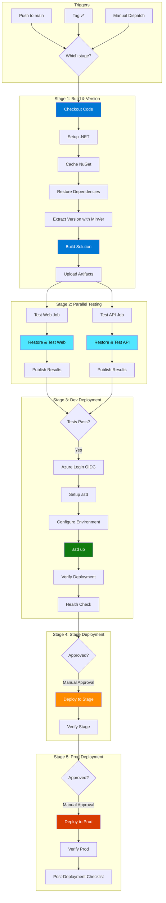
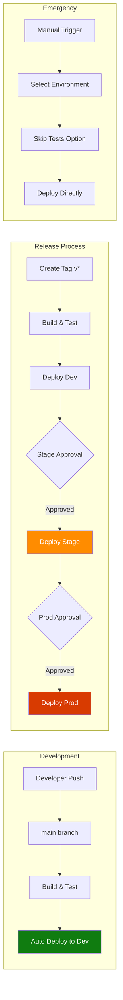
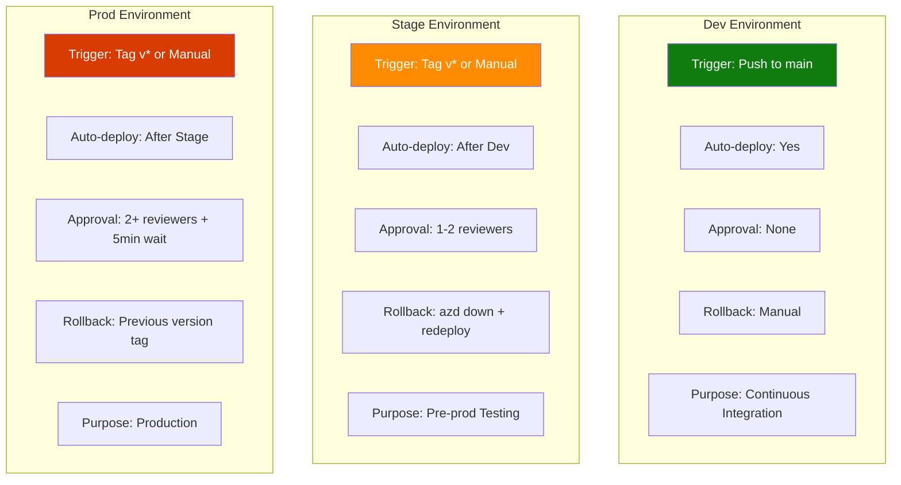
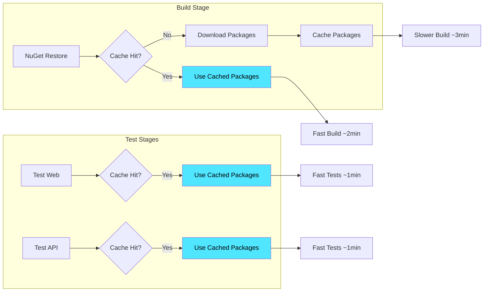
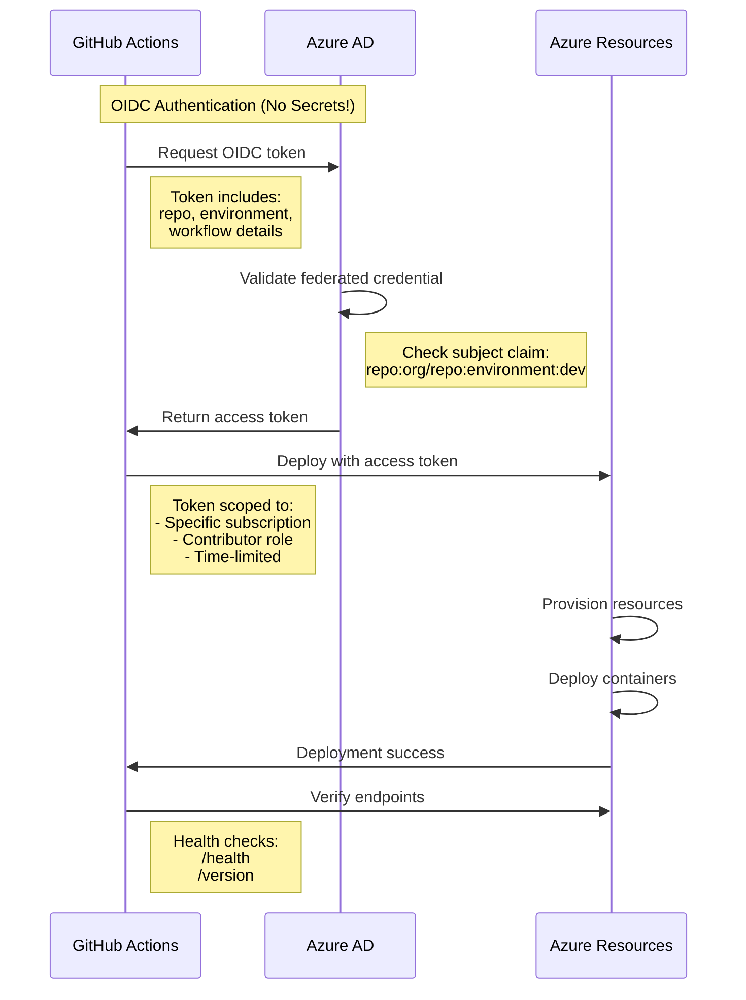
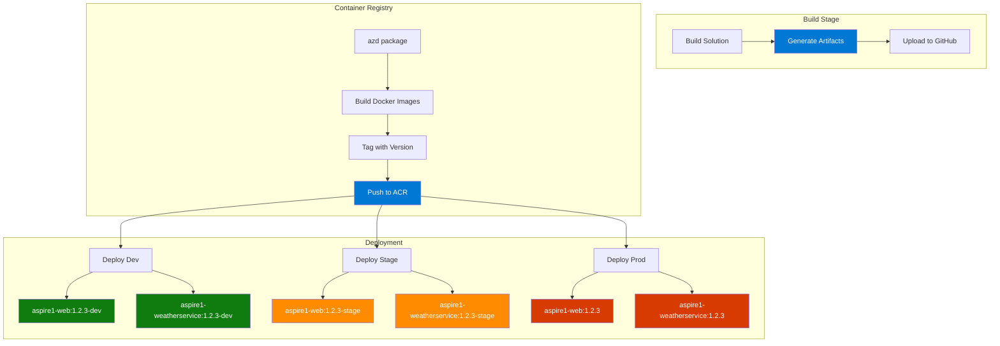

# Pipeline Architecture Visualization

## High-Level Pipeline Flow



## Parallel Execution Model

```mermaid
gantt
    title Pipeline Execution Timeline
    dateFormat X
    axisFormat %M:%S

    section Build
    Restore & Build    :0, 180s

    section Test (Parallel)
    Web Tests          :180, 120s
    API Tests          :180, 120s

    section Deploy Dev
    Provision & Deploy :300, 240s
    Verify            :540, 60s

    section Deploy Stage
    Wait for Approval :600, 120s
    Provision & Deploy:720, 240s
    Verify            :960, 60s

    section Deploy Prod
    Wait for Approval :1020, 300s
    Provision & Deploy:1320, 240s
    Verify            :1560, 60s
```



## Environment Flow



## Deployment Strategy by Environment



## Caching Strategy



## Security & Authentication Flow



## Artifact Flow



## Monitoring & Observability

```mermaid
graph TB
    subgraph "Pipeline Execution"
        P1[Workflow Run] --> P2[Job Steps]
        P2 --> P3[Action Logs]
    end
    
    subgraph "Deployment Verification"
        D1[Health Endpoint] --> D2[/health]
        D1 --> D3[/version]
        D1 --> D4[/health/detailed]
    end
    
    subgraph "Application Monitoring"
        A1[App Insights] --> A2[Custom Metrics]
        A1 --> A3[Traces]
        A1 --> A4[Logs]
        A1 --> A5[Exceptions]
    end
    
    subgraph "Alerts"
        AL1[Deployment Failed] --> N1[Notify Team]
        AL2[Tests Failed] --> N1
        AL3[Health Check Failed] --> N1
    end
    
    P3 --> Summary[GitHub Summary]
    D2 --> Summary
    D3 --> Summary
    D4 --> Summary
    
    A2 --> Dashboard[Azure Dashboard]
    A3 --> Dashboard
    A4 --> Dashboard
    
    style Summary fill:#0078d4,color:#fff
    style Dashboard fill:#68217a,color:#fff
    style N1 fill:#d83b01,color:#fff
```
