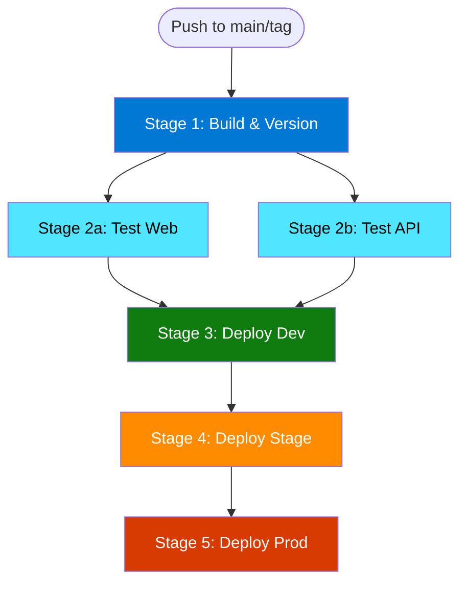

# Multistage CI/CD Pipeline Setup Guide

This guide explains how to configure and use the multistage build and deployment pipeline for the aspire1 application.

## 🏗️ Pipeline Architecture

The pipeline consists of 5 stages that run in sequence with parallelization where possible:



### Stage Details

| Stage | Description | Runs When | Parallel | Duration |
|-------|-------------|-----------|----------|----------|
| **Build** | Restore, build, version extraction | Always | No | ~2-3 min |
| **Test Web** | Run Web.Tests | After build | Yes (with API tests) | ~1-2 min |
| **Test API** | Run WeatherService.Tests | After build | Yes (with Web tests) | ~1-2 min |
| **Deploy Dev** | Deploy to dev environment | After tests pass, on main branch | No | ~3-5 min |
| **Deploy Stage** | Deploy to staging | After dev success, on tags or manual | No | ~3-5 min |
| **Deploy Prod** | Deploy to production | After stage success, on tags or manual | No | ~3-5 min |

**Total Pipeline Time:**
- **Dev only (main branch):** ~6-10 minutes
- **Dev → Stage → Prod (tag):** ~15-20 minutes

## 🔧 Setup Instructions

### Step 1: Create GitHub Environments

Create three environments in your GitHub repository with protection rules:

#### Environment: `dev`
- **Protection Rules:** None (auto-deploy on main)
- **Purpose:** Automatic deployments for continuous integration

#### Environment: `stage`
- **Protection Rules:** 
  - Required reviewers: 1-2 people
  - Wait timer: 0 minutes
- **Purpose:** Pre-production testing with manual approval

#### Environment: `prod`
- **Protection Rules:**
  - Required reviewers: 2+ people
  - Wait timer: 5 minutes (cooling period)
  - Deployment branches: Only protected branches
- **Purpose:** Production deployments with strict controls

**How to create environments:**
1. Go to repository **Settings** → **Environments**
2. Click **New environment**
3. Enter environment name (`dev`, `stage`, or `prod`)
4. Configure protection rules as specified above
5. Add environment-specific secrets and variables (see below)

### Step 2: Configure Azure Service Principals

You'll need separate service principals for each environment with OIDC federation.

#### Create Service Principals

```bash
# Set variables
SUBSCRIPTION_ID_DEV="<your-dev-subscription-id>"
SUBSCRIPTION_ID_STAGE="<your-stage-subscription-id>"
SUBSCRIPTION_ID_PROD="<your-prod-subscription-id>"
GITHUB_ORG="<your-github-org>"
GITHUB_REPO="<your-repo-name>"

# Create Dev Service Principal
az ad sp create-for-rbac \
  --name "aspire1-github-dev" \
  --role contributor \
  --scopes /subscriptions/$SUBSCRIPTION_ID_DEV \
  --sdk-auth

# Create Stage Service Principal
az ad sp create-for-rbac \
  --name "aspire1-github-stage" \
  --role contributor \
  --scopes /subscriptions/$SUBSCRIPTION_ID_STAGE \
  --sdk-auth

# Create Prod Service Principal
az ad sp create-for-rbac \
  --name "aspire1-github-prod" \
  --role contributor \
  --scopes /subscriptions/$SUBSCRIPTION_ID_PROD \
  --sdk-auth
```

#### Configure OIDC Federation

For each service principal, configure federated credentials:

```bash
# Get the Application (client) ID from the service principal output
APP_ID_DEV="<dev-client-id>"
APP_ID_STAGE="<stage-client-id>"
APP_ID_PROD="<prod-client-id>"

# Create federated credential for Dev (environment-specific)
az ad app federated-credential create \
  --id $APP_ID_DEV \
  --parameters '{
    "name": "github-dev-environment",
    "issuer": "https://token.actions.githubusercontent.com",
    "subject": "repo:'$GITHUB_ORG'/'$GITHUB_REPO':environment:dev",
    "description": "GitHub Actions Dev Environment",
    "audiences": ["api://AzureADTokenExchange"]
  }'

# Create federated credential for Stage
az ad app federated-credential create \
  --id $APP_ID_STAGE \
  --parameters '{
    "name": "github-stage-environment",
    "issuer": "https://token.actions.githubusercontent.com",
    "subject": "repo:'$GITHUB_ORG'/'$GITHUB_REPO':environment:stage",
    "description": "GitHub Actions Stage Environment",
    "audiences": ["api://AzureADTokenExchange"]
  }'

# Create federated credential for Prod
az ad app federated-credential create \
  --id $APP_ID_PROD \
  --parameters '{
    "name": "github-prod-environment",
    "issuer": "https://token.actions.githubusercontent.com",
    "subject": "repo:'$GITHUB_ORG'/'$GITHUB_REPO':environment:prod",
    "description": "GitHub Actions Prod Environment",
    "audiences": ["api://AzureADTokenExchange"]
  }'
```

### Step 3: Configure GitHub Secrets

#### Repository Secrets (Shared)

Add these secrets at the repository level (**Settings** → **Secrets and variables** → **Actions**):

| Secret Name | Description | Example |
|-------------|-------------|---------|
| `AZURE_TENANT_ID` | Azure AD Tenant ID (shared across all environments) | `12345678-1234-1234-1234-123456789012` |

#### Environment Secrets (Per Environment)

For **each environment** (`dev`, `stage`, `prod`), add these secrets:

**Dev Environment:**
| Secret Name | Description |
|-------------|-------------|
| `AZURE_CLIENT_ID_DEV` | Client ID of dev service principal |
| `AZURE_SUBSCRIPTION_ID_DEV` | Azure subscription ID for dev |

**Stage Environment:**
| Secret Name | Description |
|-------------|-------------|
| `AZURE_CLIENT_ID_STAGE` | Client ID of stage service principal |
| `AZURE_SUBSCRIPTION_ID_STAGE` | Azure subscription ID for stage |

**Prod Environment:**
| Secret Name | Description |
|-------------|-------------|
| `AZURE_CLIENT_ID_PROD` | Client ID of prod service principal |
| `AZURE_SUBSCRIPTION_ID_PROD` | Azure subscription ID for prod |

### Step 4: Configure GitHub Variables (Optional)

Add environment variables for Azure locations (**Settings** → **Secrets and variables** → **Actions** → **Variables**):

| Variable Name | Default | Description |
|---------------|---------|-------------|
| `AZURE_LOCATION_DEV` | `eastus` | Azure region for dev environment |
| `AZURE_LOCATION_STAGE` | `eastus` | Azure region for stage environment |
| `AZURE_LOCATION_PROD` | `eastus` | Azure region for prod environment |

## 🚀 Usage

### Automatic Deployments

1. **Dev Environment (Automatic)**
   - Triggers on: Push to `main` branch
   - No approval required
   - Deploys immediately after tests pass

2. **Stage Environment (Manual approval)**
   - Triggers on: Git tags starting with `v` (e.g., `v1.0.0`)
   - Requires: Dev deployment success + manual approval
   - Use for: Pre-production validation

3. **Prod Environment (Manual approval)**
   - Triggers on: Git tags starting with `v`
   - Requires: Stage deployment success + manual approval
   - Use for: Production releases

### Manual Deployment

Use workflow dispatch to deploy to any environment:

1. Go to **Actions** → **Multistage Build and Deploy**
2. Click **Run workflow**
3. Select:
   - **Branch:** Usually `main` or a tag
   - **Environment:** `dev`, `stage`, or `prod`
   - **Skip tests:** Optional (for emergency hotfixes)
4. Click **Run workflow**

### Example Workflows

#### Scenario 1: Regular Development (Dev Only)

```bash
# Make changes
git add .
git commit -m "Add new feature"
git push origin main
```

**Result:** Automatically deploys to dev environment after tests pass

#### Scenario 2: Release to All Environments

```bash
# Ensure main is ready for release
git checkout main
git pull

# Create and push a version tag
git tag v1.2.3
git push origin v1.2.3
```

**Result:** 
1. Deploys to dev automatically
2. Prompts for approval to deploy to stage
3. After stage approval, prompts for approval to deploy to prod

#### Scenario 3: Hotfix to Production

```bash
# Use workflow dispatch
# 1. Go to GitHub Actions
# 2. Select "Multistage Build and Deploy"
# 3. Run workflow:
#    - Environment: prod
#    - Skip tests: true (if needed)
```

## 🔍 Monitoring and Verification

### Pipeline Monitoring

Each deployment job outputs:
- Version deployed
- Commit SHA
- Service endpoint URLs
- Health check results

Check the **Summary** tab for each workflow run for a complete overview.

### Post-Deployment Verification

After each deployment, verify:

1. **Application Health**
   ```bash
   curl https://<api-url>/health
   curl https://<api-url>/version
   ```

2. **Application Insights**
   - Check Azure Portal → Application Insights
   - Verify no errors or exceptions
   - Check custom metrics dashboard

3. **Feature Flags**
   - Verify in Azure App Configuration
   - Test feature toggles work correctly

## 🛠️ Troubleshooting

### Common Issues

#### Issue: "OIDC token validation failed"

**Cause:** Federated credential not configured correctly

**Fix:**
1. Verify the `subject` claim in federated credential matches: `repo:ORG/REPO:environment:ENV`
2. Check the environment name matches exactly (case-sensitive)
3. Ensure service principal has Contributor role on subscription

#### Issue: "Environment not found"

**Cause:** GitHub environment not created

**Fix:** Create the environment in GitHub Settings → Environments

#### Issue: Tests failing in pipeline but passing locally

**Cause:** Environment differences or missing dependencies

**Fix:**
1. Check test logs for specific errors
2. Ensure all test dependencies are restored
3. Verify NuGet cache is working correctly

#### Issue: Deployment succeeds but app doesn't start

**Cause:** Container startup failure or misconfiguration

**Fix:**
1. Check Container App logs in Azure Portal
2. Verify environment variables are set correctly
3. Check Application Insights for startup errors

### Debug Mode

To enable detailed logging in the pipeline:

1. Add a repository secret: `ACTIONS_STEP_DEBUG` = `true`
2. Add a repository secret: `ACTIONS_RUNNER_DEBUG` = `true`
3. Re-run the workflow

## 📊 Pipeline Metrics

Track these metrics for pipeline health:

| Metric | Target | Alert Threshold |
|--------|--------|----------------|
| Build Success Rate | >95% | <90% |
| Test Success Rate | >98% | <95% |
| Deployment Time (Dev) | <10 min | >15 min |
| Deployment Time (Prod) | <20 min | >30 min |
| Pipeline Failure Rate | <5% | >10% |

## 🔐 Security Best Practices

1. **Never commit secrets** to the repository
2. **Use environment-specific service principals** with least-privilege access
3. **Enable required reviewers** for stage and prod environments
4. **Rotate service principal credentials** every 90 days
5. **Monitor failed authentication attempts** in Azure AD audit logs
6. **Use separate subscriptions** for prod vs non-prod when possible
7. **Enable branch protection** on main branch

## 📚 Additional Resources

- [Azure Developer CLI Documentation](https://learn.microsoft.com/azure/developer/azure-developer-cli/)
- [GitHub Actions OIDC with Azure](https://docs.github.com/en/actions/deployment/security-hardening-your-deployments/configuring-openid-connect-in-azure)
- [GitHub Environments Documentation](https://docs.github.com/en/actions/deployment/targeting-different-environments/using-environments-for-deployment)
- [.NET Aspire Documentation](https://learn.microsoft.com/dotnet/aspire/)
