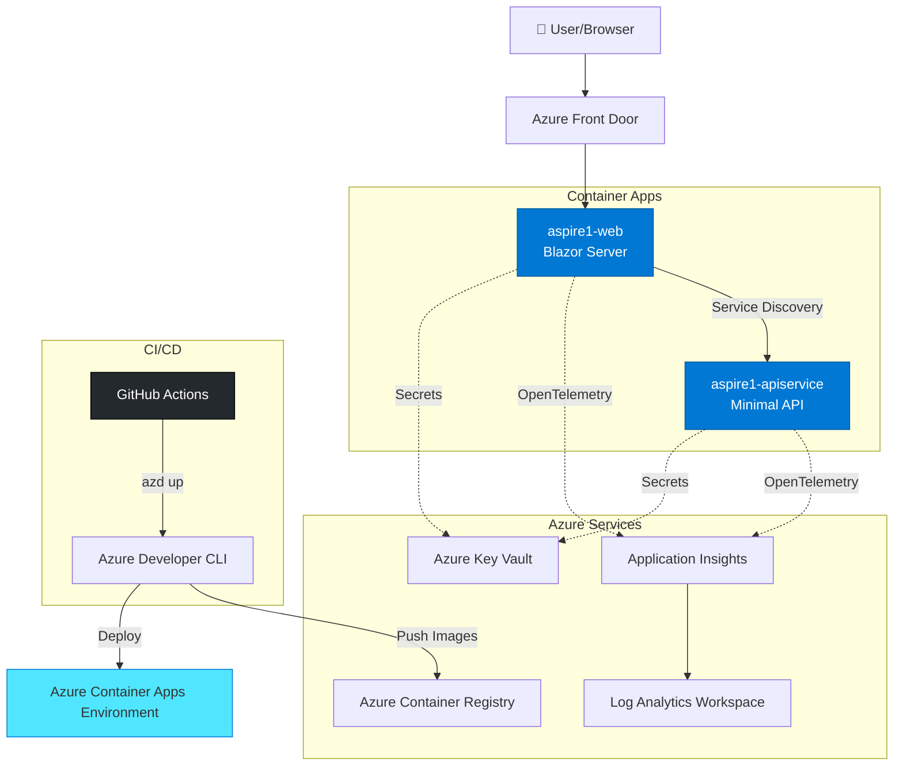
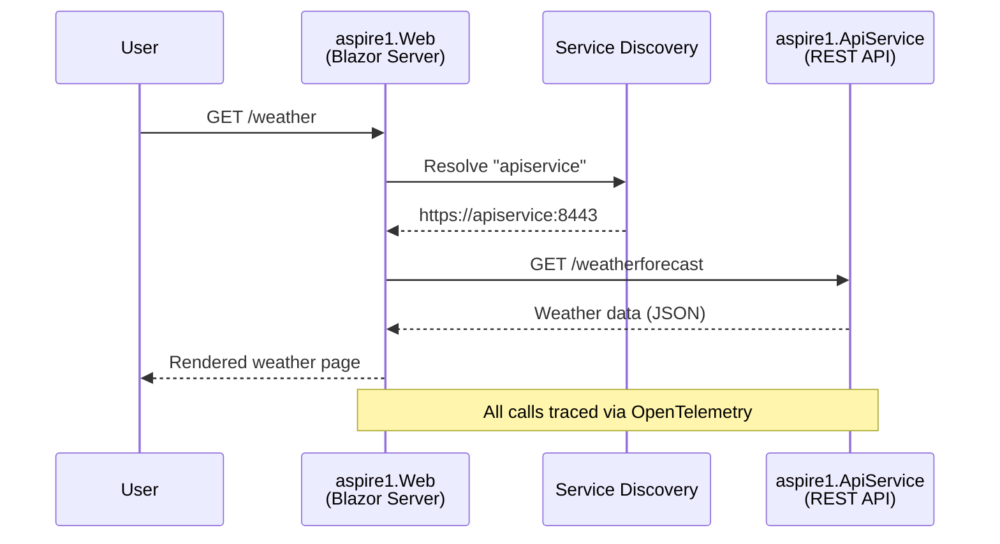
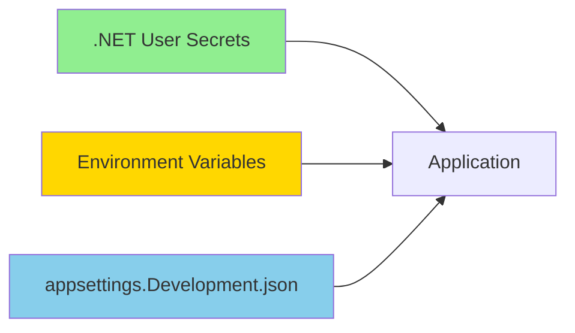
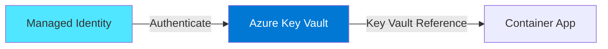
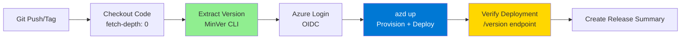
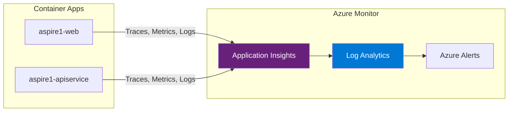

# Architecture Documentation - aspire1

> **Version:** 1.0.0
> **Last Updated:** December 9, 2025
> **Stack:** .NET Aspire 13.x, .NET 10.0, Azure Container Apps

## 🎯 High-Level Architecture



## 📊 Component Matrix

| Component                    | Type          | Port(s)          | Dependencies            | Health Endpoint               | Container Image                |
| ---------------------------- | ------------- | ---------------- | ----------------------- | ----------------------------- | ------------------------------ |
| **aspire1.Web**              | Blazor Server | 8080, 8443       | aspire1.ApiService      | `/health`                     | `aspire1-web:{version}`        |
| **aspire1.ApiService**       | Minimal API   | 8080, 8443       | aspire1.ServiceDefaults | `/health`, `/health/detailed` | `aspire1-apiservice:{version}` |
| **aspire1.ServiceDefaults**  | Class Library | N/A              | -                       | N/A                           | N/A                            |
| **aspire1.AppHost**          | Orchestrator  | 5000 (dashboard) | All projects            | N/A                           | N/A                            |
| **aspire1.Web.Tests**        | Test Project  | N/A              | aspire1.Web             | N/A                           | N/A                            |
| **aspire1.ApiService.Tests** | Test Project  | N/A              | aspire1.ApiService      | N/A                           | N/A                            |

### Additional Endpoints

| Service            | Endpoint               | Purpose                                        |
| ------------------ | ---------------------- | ---------------------------------------------- |
| aspire1.ApiService | `GET /`                | Service status message                         |
| aspire1.ApiService | `GET /weatherforecast` | Sample weather data API                        |
| aspire1.ApiService | `GET /version`         | Version + commit SHA for deployment tracking   |
| aspire1.ApiService | `GET /health/detailed` | Enhanced health with version for OpenTelemetry |

## 🏗️ Project Structure

```
aspire1/
├── aspire1.AppHost/              # Orchestration & service discovery
│   ├── AppHost.cs                # Defines service topology
│   ├── appsettings.json          # Environment-agnostic config
│   └── ARCHITECTURE.md           # AppHost-specific architecture
│
├── aspire1.ApiService/           # Backend REST API
│   ├── Program.cs                # API endpoints & middleware
│   ├── appsettings.json          # Default configuration
│   └── ARCHITECTURE.md           # API service architecture
│
├── aspire1.Web/                  # Blazor Server frontend
│   ├── Program.cs                # Web app configuration
│   ├── Components/               # Blazor components
│   │   ├── Pages/                # Routable pages
│   │   └── Layout/               # Layout components
│   └── ARCHITECTURE.md           # Web service architecture
│
├── aspire1.ServiceDefaults/      # Shared Aspire defaults
│   ├── Extensions.cs             # OpenTelemetry, health, resilience
│   └── ARCHITECTURE.md           # Service defaults architecture
│
├── aspire1.ApiService.Tests/     # API service unit tests
│   └── Services/
│       └── CachedWeatherServiceTests.cs  # Cache service tests
│
├── aspire1.Web.Tests/            # Web frontend unit tests
│   └── WeatherApiClientTests.cs  # HTTP client tests
│
├── .github/
│   └── workflows/
│       └── deploy.yml            # CI/CD pipeline (GitHub Actions)
│
├── Directory.Build.props         # Centralized versioning with MinVer
├── azure.yaml                    # Azure Developer CLI manifest
└── ARCHITECTURE.md               # This file
```

## 🔄 Service Discovery & Communication

### Internal Communication Flow



### Service Discovery Configuration

- **Scheme:** `https+http://` (prefers HTTPS, falls back to HTTP)
- **Internal DNS:** `apiservice` resolves within ACA Environment
- **External access:** Only `aspire1-web` exposed via ingress
- **Resilience:** Polly with retry, circuit breaker, timeout (from ServiceDefaults)

## 🔐 Secrets & Configuration Management

### Local Development



**Commands:**

```bash
# Set local secrets
dotnet user-secrets set "ConnectionStrings:MyDb" "..." --project aspire1.ApiService

# Run locally
dotnet run --project aspire1.AppHost
```

### Azure Production



**Configuration:**

- Secrets stored in **Azure Key Vault** only
- Container Apps use **managed identity** to access Key Vault
- Connection strings injected as environment variables via Key Vault references
- **NEVER** commit secrets to git (protected by `.gitignore`)

### Configuration Priority (Highest to Lowest)

1. Environment variables (set by AppHost or ACA)
2. Azure Key Vault references
3. `appsettings.{Environment}.json`
4. `appsettings.json`
5. User Secrets (local dev only)

## 🚀 Deployment Topology

### Azure Container Apps Environment


### Container App Configuration

| Setting           | aspire1-web                    | aspire1-apiservice            |
| ----------------- | ------------------------------ | ----------------------------- |
| **Ingress**       | External (HTTPS)               | Internal only                 |
| **Min Replicas**  | 1                              | 1                             |
| **Max Replicas**  | 10                             | 5                             |
| **CPU**           | 0.5 cores                      | 0.25 cores                    |
| **Memory**        | 1.0 Gi                         | 0.5 Gi                        |
| **Health Probe**  | `/health`                      | `/health`                     |
| **Revision Mode** | Single                         | Single                        |
| **Scale Rule**    | HTTP (100 concurrent requests) | HTTP (50 concurrent requests) |

## 📦 CI/CD Pipeline

### GitHub Actions Workflow



### Trigger Conditions

| Event               | Branch/Tag    | Environment  | Action        |
| ------------------- | ------------- | ------------ | ------------- |
| `push`              | `v*` tag      | `dev`        | Deploy to dev |
| `push`              | `main` branch | `dev`        | Deploy to dev |
| `workflow_dispatch` | Any           | User selects | Manual deploy |

### azd Hooks (azure.yaml)

1. **preprovision**: Extract version with MinVer, set `VERSION` and `COMMIT_SHA`
2. **prepackage**: Tag container images with version from registry endpoint
3. **postdeploy**: Verify deployment, log version info

### Deployment Speed

- **Target:** <90 seconds from `git push` to live
- **Optimizations:**
  - NuGet package caching
  - Parallel service builds
  - Incremental container image layers
  - Azure CLI authentication via OIDC (no secrets!)

## 📈 Observability & Monitoring

### OpenTelemetry Stack



### Instrumentation (ServiceDefaults)

- **Traces:** ASP.NET Core, HttpClient, custom sources
- **Metrics:** ASP.NET Core, HttpClient, Runtime (GC, threads, exceptions)
- **Logs:** Structured logging with scopes, formatted messages
- **Health Checks:** `/health` (all checks), `/alive` (liveness only)
- **Filters:** Health check endpoints excluded from tracing

### Key Metrics to Monitor

| Metric                      | Alert Threshold | Purpose                 |
| --------------------------- | --------------- | ----------------------- |
| HTTP Request Duration (P95) | >2 seconds      | Latency spike detection |
| HTTP Request Rate           | N/A             | Traffic patterns        |
| Exception Rate              | >5% of requests | Error rate monitoring   |
| Container CPU %             | >80% sustained  | Scale-out trigger       |
| Container Memory %          | >85% sustained  | Memory pressure         |
| Health Check Failures       | >3 consecutive  | Service degradation     |

### Log Analytics Queries

```kql
// All traces for a specific version
traces
| where customDimensions.version == "1.0.0"
| project timestamp, message, severityLevel

// Failed requests with version context
requests
| where success == false
| extend version = tostring(customDimensions.version)
| project timestamp, name, resultCode, duration, version
| order by timestamp desc

// Exception analysis by service
exceptions
| extend service = tostring(customDimensions.service)
| summarize count() by service, type
```

## 🛡️ Resilience & Scaling

### Resilience Patterns (via ServiceDefaults)

- **Retry Policy:** 3 attempts with exponential backoff
- **Circuit Breaker:** Opens after 5 consecutive failures
- **Timeout:** 10 seconds per request
- **Bulkhead Isolation:** Limit concurrent requests

### KEDA Autoscaling Rules

| Service            | Trigger               | Scale In Delay | Scale Out Delay |
| ------------------ | --------------------- | -------------- | --------------- |
| aspire1-web        | HTTP (100 concurrent) | 5 min          | 30 sec          |
| aspire1-apiservice | HTTP (50 concurrent)  | 5 min          | 30 sec          |

**Cold Start Strategy:**

- Min replicas = 1 (always warm)
- Pre-warmed instances reduce P99 latency

## 🔧 Troubleshooting Cheat Sheet

### Local Development

```bash
# View Aspire dashboard
dotnet run --project aspire1.AppHost
# Navigate to: http://localhost:5000

# Check service health
curl http://localhost:{port}/health

# View version info
curl http://localhost:{port}/version

# Tail logs
dotnet watch --project aspire1.ApiService
```

### Azure (Production)

```bash
# Show deployed resources
azd show

# Get container app logs (last 10 min)
az containerapp logs show \
  --name aspire1-apiservice \
  --resource-group rg-aspire1-prod \
  --follow

# Check container app status
az containerapp show \
  --name aspire1-apiservice \
  --resource-group rg-aspire1-prod \
  --query "properties.runningStatus"

# Test version endpoint
curl https://aspire1-apiservice.{aca-env}.eastus.azurecontainerapps.io/version

# View Application Insights live metrics
az monitor app-insights component show \
  --app ai-aspire1-prod \
  --resource-group rg-aspire1-prod
```

### Common Issues

| Symptom                    | Likely Cause              | Fix                                                                                  |
| -------------------------- | ------------------------- | ------------------------------------------------------------------------------------ |
| 503 Service Unavailable    | Container not ready       | Check `/health` endpoint, review startup logs                                        |
| Service discovery fails    | Incorrect service name    | Verify `builder.AddProject<>()` name matches HttpClient base address                 |
| Secrets not loading        | Key Vault access denied   | Verify managed identity has `Get Secret` permission                                  |
| MinVer shows "0.0.0-alpha" | No git tags               | Run `git tag v1.0.0` and rebuild                                                     |
| CI/CD fails at azd step    | Missing Azure credentials | Verify GitHub secrets: `AZURE_CLIENT_ID`, `AZURE_TENANT_ID`, `AZURE_SUBSCRIPTION_ID` |

## 📚 Versioning Strategy

### SemVer with MinVer

- **Source:** Git tags (`v{major}.{minor}.{patch}`)
- **Format:** `1.2.3+commitsha`
- **Local builds:** `1.0.0-local+commitsha`
- **CI builds:** Exact version from tag

**Bump Version:**

```bash
# Patch: v1.0.0 → v1.0.1
git tag v1.0.1

# Minor: v1.0.1 → v1.1.0
git tag v1.1.0

# Major: v1.1.0 → v2.0.0
git tag v2.0.0

# Push and trigger CI/CD
git push origin v2.0.0
```

### Container Image Tags

- **Production:** `aspire1-apiservice:1.2.3`
- **Latest:** `aspire1-apiservice:latest` (always points to latest release)
- **Rollback:** `azd deploy --from-revision aspire1-apiservice--1-2-2`

## 🎯 Next Steps & Enhancements

### Planned Features

- [ ] Implement Azure App Configuration for feature flags
- [ ] Add Azure SQL Database with EF Core
- [ ] Multi-region deployment with Front Door
- [ ] Dapr integration for pub/sub and state management
- [x] Unit tests with xUnit, FluentAssertions, and NSubstitute
- [ ] Integration tests with Aspire.Hosting.Testing

### Production Readiness Checklist

- [x] Centralized versioning (MinVer)
- [x] Secrets in Key Vault only
- [x] OpenTelemetry to Application Insights
- [x] Health checks on all services
- [x] Managed identity for all Azure resources
- [x] CI/CD pipeline with GitHub Actions
- [x] Unit test coverage (>80% target)
- [ ] Custom domain + SSL certificate
- [ ] Azure Front Door for CDN + WAF
- [ ] Backup and disaster recovery plan
- [ ] Load testing (target: 1000 req/sec sustained)

## 🧪 Testing Strategy

### Unit Tests

The solution includes comprehensive unit tests following industry best practices:

**Test Framework Stack:**

- **xUnit 2.9.3** - Test framework
- **FluentAssertions 6.12.0** - Readable assertions
- **NSubstitute 5.1.0** - Mocking framework
- **coverlet.collector 6.0.4** - Code coverage

**Test Projects:**

| Project                  | Tests | Coverage | Description                            |
| ------------------------ | ----- | -------- | -------------------------------------- |
| aspire1.ApiService.Tests | 7     | >80%     | Cache service logic and error handling |
| aspire1.Web.Tests        | 10    | >80%     | HTTP client behavior and edge cases    |

**Test Naming Convention:**

```
[MethodName]_[Scenario]_[ExpectedResult]
Example: GetWeatherAsync_SuccessfulResponse_ReturnsForecasts
```

**Run Tests:**

```bash
# Run all tests
dotnet test

# Run specific project tests
dotnet test aspire1.ApiService.Tests
dotnet test aspire1.Web.Tests

# Run with coverage
dotnet test --collect:"XPlat Code Coverage"
```

**Test Coverage Highlights:**

- ✅ Cache hit/miss scenarios
- ✅ Cache read/write failures with graceful degradation
- ✅ HTTP client success/error responses
- ✅ Cancellation token handling
- ✅ Edge cases (empty data, various counts)
- ✅ Temperature conversion validation

**Key Test Patterns:**

```csharp
// ApiService: Mocking IDistributedCache
_mockCache.GetAsync(Arg.Any<string>(), Arg.Any<CancellationToken>())
    .Returns(cachedData);

// Web: Mocking HttpMessageHandler
var handler = new MockHttpMessageHandler(HttpStatusCode.OK, json);
var httpClient = new HttpClient(handler);

// Assertions with FluentAssertions
result.Should().NotBeNull();
result.Should().HaveCount(5);
forecast.TemperatureC.Should().Be(20);
```

### Integration Tests (Planned)

Future integration tests will use `Aspire.Hosting.Testing` to:

- Spin up full distributed application with real containers
- Test service-to-service communication via service discovery
- Verify health endpoints and OpenTelemetry traces
- Validate Redis caching end-to-end

## 📖 References

- [.NET Aspire Documentation](https://learn.microsoft.com/dotnet/aspire/)
- [Azure Container Apps](https://learn.microsoft.com/azure/container-apps/)
- [Azure Developer CLI](https://learn.microsoft.com/azure/developer/azure-developer-cli/)
- [xUnit Documentation](https://xunit.net/)
- [FluentAssertions Documentation](https://fluentassertions.com/)
- [MinVer](https://github.com/adamralph/minver)
- [OpenTelemetry .NET](https://opentelemetry.io/docs/languages/net/)

---

**Last Updated:** December 9, 2025
**Maintained by:** DevOps Team
**Review Cadence:** Every major version bump or architectural change
