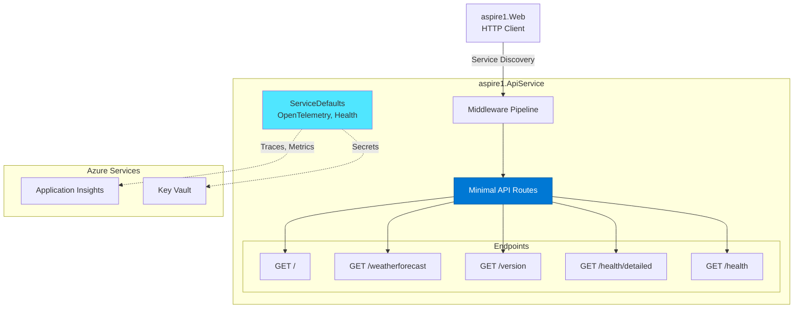
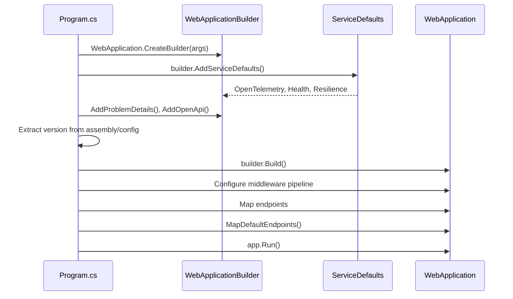
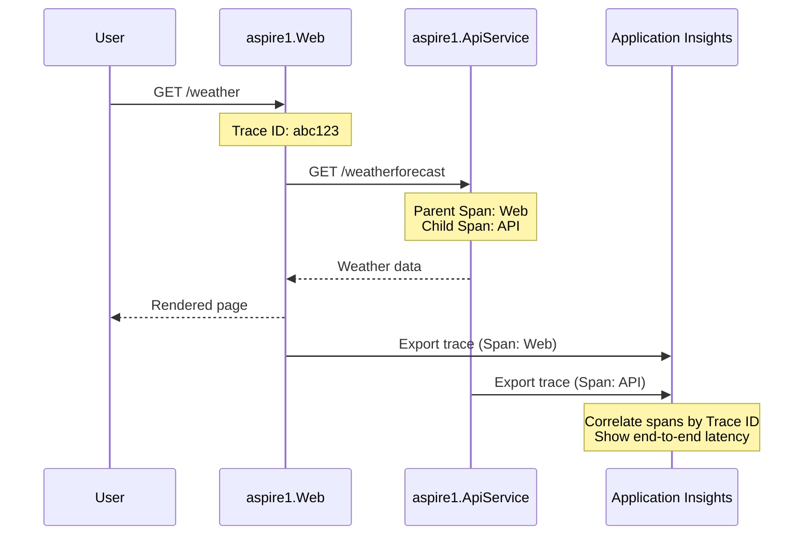

# Architecture - aspire1.ApiService

> **Component Type:** Minimal API (REST)  
> **Framework:** ASP.NET Core 10.0  
> **Purpose:** Backend API service providing weather data and system metadata

## 🎯 Overview

The **ApiService** is a lightweight REST API built with ASP.NET Core Minimal APIs. It demonstrates:
- Minimal API routing (no controllers)
- OpenTelemetry instrumentation (via ServiceDefaults)
- Health checks with version metadata
- Service discovery (consumed by aspire1.Web)
- SemVer-based deployment tracking

## 🏗️ Architecture



## 📡 API Endpoints

### `GET /`
**Purpose:** Root status message

**Response:**
```json
"API service is running. Navigate to /weatherforecast to see sample data."
```

---

### `GET /weatherforecast`
**Purpose:** Sample weather data generator

**Response:**
```json
[
  {
    "date": "2025-12-10",
    "temperatureC": 15,
    "temperatureF": 59,
    "summary": "Mild"
  },
  // ... 4 more days
]
```

**Implementation:**
- Generates 5 days of random weather forecasts
- Uses in-memory data (no database)
- Demonstrates JSON serialization

---

### `GET /version`
**Purpose:** Deployment tracking and version verification

**Response:**
```json
{
  "version": "1.0.0+a1af010e18",
  "commitSha": "a1af010",
  "service": "apiservice",
  "environment": "Production",
  "timestamp": "2025-12-09T18:30:00Z"
}
```

**Use Cases:**
- Verify deployed version in Azure Portal
- Compare versions across environments (dev/staging/prod)
- Correlate application behavior with git commits
- Smoke test after deployment

---

### `GET /health/detailed`
**Purpose:** Enhanced health check with version metadata for OpenTelemetry correlation

**Response:**
```json
{
  "status": "healthy",
  "version": "1.0.0+a1af010e18",
  "commitSha": "a1af010",
  "service": "apiservice",
  "timestamp": "2025-12-09T18:30:00Z",
  "uptime": 3600.5
}
```

**Use Cases:**
- Debugging distributed traces (find which version produced a span)
- Uptime monitoring (seconds since container start)
- Service mesh health dashboards

---

### `GET /health`
**Purpose:** Standard Aspire health check (from ServiceDefaults)

**Response:** `Healthy` (200 OK) or `Unhealthy` (503 Service Unavailable)

**Checks:**
- `self`: Always returns `Healthy` (liveness probe)
- Additional checks can be added (database, cache, etc.)

**Configuration:**
- Managed by `ServiceDefaults.MapDefaultEndpoints()`
- Only exposed in Development environment by default
- ACA uses this for readiness/liveness probes

## 🔧 Startup Configuration

### Program.cs Flow



### Key Configuration Steps

1. **Service Defaults:** Registers OpenTelemetry, health checks, resilience handlers
2. **Problem Details:** Standardized error responses (RFC 7807)
3. **OpenAPI:** Swagger/OpenAPI documentation generation
4. **Version Extraction:** Reads from `APP_VERSION` env var or assembly metadata
5. **Middleware Pipeline:** Exception handler, HTTPS redirection (production)
6. **Endpoint Mapping:** Minimal API routes
7. **Health Endpoints:** `/health`, `/alive` (from ServiceDefaults)

## 🔐 Configuration & Secrets

### Configuration Sources (Priority Order)

1. **Environment Variables** (highest priority)
   - `APP_VERSION` - Injected by AppHost or azd
   - `COMMIT_SHA` - Injected by AppHost or GitHub Actions
   - `OTEL_EXPORTER_OTLP_ENDPOINT` - Application Insights endpoint

2. **Azure Key Vault References** (production)
   - Connection strings
   - API keys
   - External service credentials

3. **appsettings.{Environment}.json**
   - Environment-specific non-sensitive config

4. **appsettings.json**
   - Default non-sensitive config

5. **User Secrets** (local dev only)
   - `dotnet user-secrets set "MySecret" "value"`

### Example: Adding a Database Connection

```csharp
// ❌ DON'T: Hard-code in appsettings.json
{
  "ConnectionStrings": {
    "MyDb": "Server=...;Password=..." // NEVER COMMIT THIS
  }
}

// ✅ DO: Use environment variable (Key Vault reference in ACA)
var connectionString = builder.Configuration.GetConnectionString("MyDb");
builder.Services.AddDbContext<MyDbContext>(options =>
    options.UseNpgsql(connectionString));
```

**In Azure:**
```yaml
# Bicep generates this (from AppHost)
env:
  - name: ConnectionStrings__MyDb
    secretRef: mydb-connection  # Points to Key Vault secret
```

## 📊 OpenTelemetry Instrumentation

### What's Instrumented (via ServiceDefaults)

| Type | Instrumented Components | Example |
|------|-------------------------|---------|
| **Traces** | ASP.NET Core requests, HttpClient calls | Request → `/weatherforecast` span |
| **Metrics** | Request rate, duration, CPU, memory, exceptions | `http.server.request.duration` |
| **Logs** | Structured logs with scopes and formatted messages | `Processing weather request for 5 days` |

### Example Trace Flow



### Querying Traces in Application Insights

```kql
// Find all requests to /weatherforecast with version 1.0.0
dependencies
| where target == "apiservice"
| where name contains "weatherforecast"
| extend version = tostring(customDimensions.version)
| where version == "1.0.0"
| project timestamp, duration, success, version
```

## 🚀 Deployment

### Local Development

```bash
# Run standalone (requires AppHost for service discovery)
dotnet run --project aspire1.ApiService

# Access endpoints
curl http://localhost:7002/weatherforecast
curl http://localhost:7002/version
```

### Azure Container Apps

**Container Image:**
- **Registry:** `{acr}.azurecr.io`
- **Repository:** `aspire1-apiservice`
- **Tag:** `{version}` (e.g., `1.0.0`)

**Environment Variables (injected by azd):**
- `APP_VERSION`: `1.0.0`
- `COMMIT_SHA`: `a1af010`
- `OTEL_EXPORTER_OTLP_ENDPOINT`: `https://...` (Application Insights)
- `ASPNETCORE_ENVIRONMENT`: `Production`

**Health Probes:**
```yaml
livenessProbe:
  httpGet:
    path: /alive
    port: 8080
  initialDelaySeconds: 5
  periodSeconds: 10

readinessProbe:
  httpGet:
    path: /health
    port: 8080
  initialDelaySeconds: 10
  periodSeconds: 5
```

**Scaling:**
- **Min Replicas:** 1 (always warm)
- **Max Replicas:** 5
- **Scale Rule:** HTTP - 50 concurrent requests per replica
- **Scale In Delay:** 5 minutes

## 🎯 Testing

### Unit Tests (Future)

```csharp
// Example with xUnit + FluentAssertions
public class WeatherForecastTests
{
    [Fact]
    public void GetWeatherForecast_Returns5Days()
    {
        // Arrange
        var forecast = GetWeatherForecast(); // Extracted logic

        // Act
        var result = forecast.ToArray();

        // Assert
        result.Should().HaveCount(5);
        result.All(f => f.Date > DateOnly.FromDateTime(DateTime.Now))
            .Should().BeTrue();
    }
}
```

### Integration Tests (Future)

```csharp
// Example with Aspire.Hosting.Testing
public class ApiServiceTests : IAsyncLifetime
{
    private DistributedApplication _app = null!;
    private HttpClient _client = null!;

    public async Task InitializeAsync()
    {
        var appHost = await DistributedApplicationTestingBuilder
            .CreateAsync<Projects.aspire1_AppHost>();
        _app = await appHost.BuildAsync();
        await _app.StartAsync();

        _client = _app.CreateHttpClient("apiservice");
    }

    [Fact]
    public async Task WeatherForecast_ReturnsSuccessAndData()
    {
        // Act
        var response = await _client.GetAsync("/weatherforecast");

        // Assert
        response.StatusCode.Should().Be(HttpStatusCode.OK);
        var data = await response.Content.ReadFromJsonAsync<WeatherForecast[]>();
        data.Should().HaveCount(5);
    }

    public async Task DisposeAsync() => await _app.DisposeAsync();
}
```

## 🐛 Troubleshooting

### Service Discovery Fails

**Symptom:** aspire1.Web can't reach `/weatherforecast`

**Diagnostics:**
```bash
# From aspire1.Web container
curl http://apiservice/health
```

**Fix:**
- Ensure AppHost uses `WithReference(apiService)` on Web
- Verify service name matches: `"apiservice"` (not `"aspire1.ApiService"`)

### Version Shows "unknown"

**Symptom:** `/version` returns `{ "version": "unknown" }`

**Diagnostics:**
```bash
# Check environment variables
azd env get-values | findstr VERSION

# Check assembly version
dotnet build -c Release
$dll = Get-Item "bin/Release/net10.0/aspire1.ApiService.dll"
[System.Diagnostics.FileVersionInfo]::GetVersionInfo($dll.FullName)
```

**Fix:**
- Ensure MinVer is installed: `dotnet tool install -g minver-cli`
- Tag git repo: `git tag v1.0.0`
- Set environment variable: `azd env set VERSION $(minver)`

### Health Check Fails in ACA

**Symptom:** Container restarts repeatedly, logs show "Health check failed"

**Diagnostics:**
```bash
# View container logs
az containerapp logs show \
  --name aspire1-apiservice \
  --resource-group rg-aspire1-prod \
  --follow
```

**Fix:**
- Ensure `/health` endpoint returns 200 OK
- Check `MapDefaultEndpoints()` is called in `Program.cs`
- Verify health check is configured in ACA (via AppHost `WithHttpHealthCheck()`)

## ✅ Best Practices vs ❌ Anti-Patterns

### 1. Version Extraction

#### ❌ BAD: Hard-coded version string
```csharp
var version = "1.0.0"; // Stale immediately, manual updates required
```
**Why it's bad:** Version drifts from actual deployment, no git correlation, manual maintenance

#### ✅ GOOD: Assembly metadata + environment fallback (Current implementation)
```csharp
var version = builder.Configuration["APP_VERSION"] ??
              Assembly.GetExecutingAssembly()
                      .GetCustomAttribute<AssemblyInformationalVersionAttribute>()
                      ?.InformationalVersion ?? "unknown";
var commitSha = builder.Configuration["COMMIT_SHA"] ??
                Environment.GetEnvironmentVariable("GITHUB_SHA")?[..7] ?? "local";
```
**Why it's good:** Multiple fallback sources, MinVer auto-updates assembly version, git SHA for traceability

---

### 2. Health Check Endpoints

#### ❌ BAD: No version metadata
```csharp
app.MapGet("/health", () => "Healthy");
```
**Why it's bad:** Can't correlate issues with deployed version, no uptime tracking, minimal diagnostics

#### ✅ GOOD: Enhanced health with version (Current implementation)
```csharp
app.MapGet("/health/detailed", () => new
{
    status = "healthy",
    version,
    commitSha,
    service = "apiservice",
    timestamp = DateTime.UtcNow,
    uptime = Environment.TickCount64 / 1000.0
})
.WithName("GetDetailedHealth");
```
**Why it's good:** OpenTelemetry correlation, deployment tracking, uptime monitoring, troubleshooting context

---

### 3. Secrets Management

#### ❌ BAD: Connection string in appsettings.json
```json
{
  "ConnectionStrings": {
    "MyDb": "Server=prod.db.com;User=sa;Password=P@ssw0rd123;"
  }
}
```
**Why it's bad:** Secrets in source control, exposed in logs, no rotation, compliance violation

#### ✅ GOOD: Key Vault reference (aspire1 pattern)
```json
{
  "ConnectionStrings": {
    "MyDb": ""  // Empty placeholder
  }
}
```
```yaml
# Environment variable in ACA (set by azd hooks)
ConnectionStrings__MyDb: "@Microsoft.KeyVault(SecretUri=https://kv-aspire1.vault.azure.net/secrets/mydb-connection)"
```
**Why it's good:** Zero secrets in code, managed identity auth, automatic rotation, audit trail

---

### 4. Service Defaults Registration

#### ❌ BAD: Manual OpenTelemetry setup in every service
```csharp
builder.Services.AddOpenTelemetry()
    .WithTracing(tracing => tracing.AddAspNetCoreInstrumentation())
    .WithMetrics(metrics => metrics.AddAspNetCoreInstrumentation());
// Repeated in every service, inconsistent config
```
**Why it's bad:** Code duplication, config drift, missing instrumentation, maintenance nightmare

#### ✅ GOOD: ServiceDefaults extension (Current implementation)
```csharp
builder.AddServiceDefaults(); // One line, consistent everywhere
```
**Why it's good:** DRY principle, consistent observability, includes resilience + service discovery, centralized updates

---

### 5. Endpoint Naming & Documentation

#### ❌ BAD: No endpoint names, no OpenAPI
```csharp
app.MapGet("/weatherforecast", () => { /* ... */ });
```
**Why it's bad:** Can't reference endpoint by name, no auto-generated docs, hard to maintain

#### ✅ GOOD: Named endpoints with OpenAPI (Current implementation)
```csharp
app.MapGet("/weatherforecast", () => { /* ... */ })
    .WithName("GetWeatherForecast");

app.MapGet("/version", () => new { version, commitSha })
    .WithName("GetVersion");
```
**Why it's good:** Endpoint referencing in tests, OpenAPI generation, link generation, route constraints

---

### 6. Configuration Fallback Strategy

#### ❌ BAD: Single source, crashes if missing
```csharp
var version = builder.Configuration["APP_VERSION"]; // NullReferenceException in local dev
```
**Why it's bad:** Breaks local development, no graceful degradation, environment-specific

#### ✅ GOOD: Multiple fallbacks with defaults (Current implementation)
```csharp
var version = builder.Configuration["APP_VERSION"] ??           // ACA/Production
              Assembly.GetExecutingAssembly()
                      .GetCustomAttribute<AssemblyInformationalVersionAttribute>()
                      ?.InformationalVersion ??                  // MinVer build
              "unknown";                                          // Fallback
```
**Why it's good:** Works in all environments, graceful degradation, clear priority order

---

### 7. Exception Handling

#### ❌ BAD: Generic try-catch everywhere
```csharp
app.MapGet("/weatherforecast", () =>
{
    try {
        return GetWeather();
    } catch (Exception ex) {
        return Results.Problem("Error");
    }
});
```
**Why it's bad:** Swallows valuable error details, breaks OpenTelemetry exception tracking, inconsistent responses

#### ✅ GOOD: Global exception handler (Current implementation)
```csharp
builder.Services.AddProblemDetails(); // RFC 7807 standard
app.UseExceptionHandler(); // Centralized exception handling
```
**Why it's good:** Consistent error format, OpenTelemetry captures exceptions, includes trace ID, production-safe

---

### 8. Minimal API Organization

#### ❌ BAD: Logic in endpoint handlers
```csharp
app.MapGet("/weatherforecast", () =>
{
    // 50 lines of business logic here
    var data = dbContext.Weather.Where(x => x.Date > DateTime.Now).ToList();
    return data.Select(x => new WeatherForecast { /* ... */ });
});
```
**Why it's bad:** Untestable, violates SRP, hard to maintain, couples HTTP to business logic

#### ✅ GOOD: Thin endpoints, extracted logic (Current implementation uses simple logic)
```csharp
app.MapGet("/weatherforecast", () =>
{
    var forecast = Enumerable.Range(1, 5).Select(index =>
        new WeatherForecast(
            DateOnly.FromDateTime(DateTime.Now.AddDays(index)),
            Random.Shared.Next(-20, 55),
            summaries[Random.Shared.Next(summaries.Length)]
        ))
        .ToArray();
    return forecast;
})
.WithName("GetWeatherForecast");
```
**Why it's good:** Testable logic, clear separation, easy to extract to service layer when needed

---

### 9. OpenTelemetry Trace Filtering

#### ❌ BAD: Trace everything including health checks
```csharp
.WithTracing(tracing =>
{
    tracing.AddAspNetCoreInstrumentation(); // No filtering
})
```
**Why it's bad:** Noisy traces, high ingestion costs, health check spam obscures real issues

#### ✅ GOOD: Filter health endpoints (ServiceDefaults implementation)
```csharp
.WithTracing(tracing =>
{
    tracing.AddAspNetCoreInstrumentation(options =>
        options.Filter = context =>
            !context.Request.Path.StartsWithSegments("/health")
            && !context.Request.Path.StartsWithSegments("/alive")
    )
})
```
**Why it's good:** Clean traces, lower costs, focuses on business operations, reduces noise

---

### 10. Environment-Specific Configuration

#### ❌ BAD: Conditional logic based on environment
```csharp
if (app.Environment.IsProduction())
{
    app.MapOpenApi(); // Wrong! OpenAPI in prod = security risk
}
```
**Why it's bad:** Exposes API schema in production, security vulnerability, manual maintenance

#### ✅ GOOD: Development-only features (Current implementation)
```csharp
if (app.Environment.IsDevelopment())
{
    app.MapOpenApi(); // Only in dev
}

app.UseExceptionHandler(); // Always on (production-safe details)
```
**Why it's good:** Secure by default, explicit opt-in for dev tools, follows least privilege

## 📚 Related Documentation

- [Root Architecture](../ARCHITECTURE.md)
- [AppHost Architecture](../aspire1.AppHost/ARCHITECTURE.md)
- [Web Service Architecture](../aspire1.Web/ARCHITECTURE.md)
- [Service Defaults](../aspire1.ServiceDefaults/ARCHITECTURE.md)

## 🔗 Useful Commands

```bash
# Run with custom version
$env:APP_VERSION="2.0.0"; dotnet run

# Test all endpoints
curl http://localhost:7002/
curl http://localhost:7002/weatherforecast
curl http://localhost:7002/version
curl http://localhost:7002/health/detailed
curl http://localhost:7002/health

# Build release container
dotnet publish -c Release
docker build -t aspire1-apiservice:1.0.0 .

# Run in container locally
docker run -p 8080:8080 -e APP_VERSION=1.0.0 aspire1-apiservice:1.0.0
```

---

**Next:** [Web Service Architecture](../aspire1.Web/ARCHITECTURE.md) →
