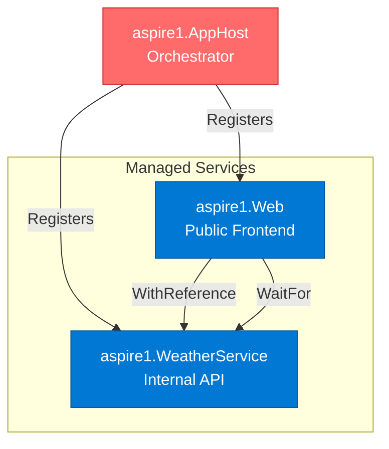
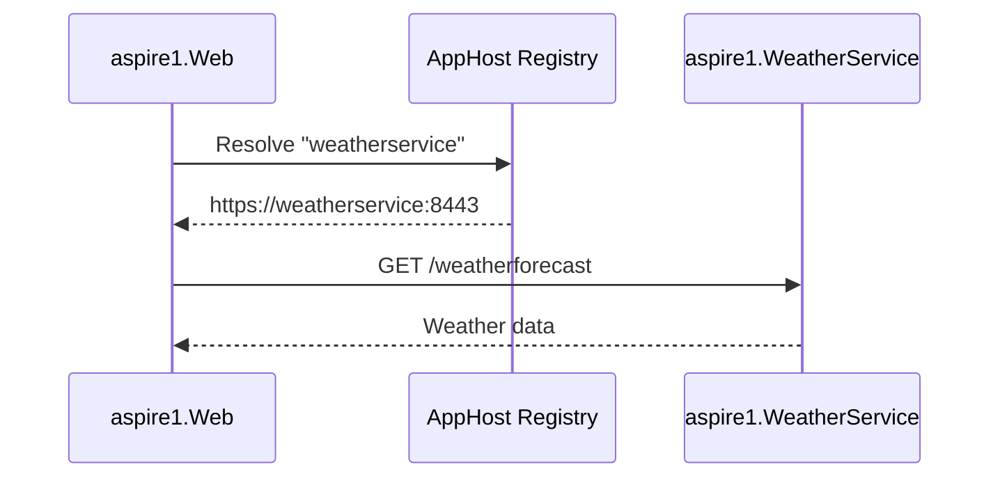

# Architecture - aspire1.AppHost

> **Component Type:** Orchestrator
> **Framework:** .NET Aspire 13.x
> **Purpose:** Service discovery, orchestration, and local development environment

## 🎯 Overview

The **AppHost** project is the heart of your Aspire application. It defines the service topology, manages dependencies, and provides the local development dashboard. In production, it generates the infrastructure-as-code (Bicep) for Azure Container Apps deployment.

## 🏗️ Responsibilities

1. **Service Registration:** Defines all projects and their relationships
2. **Service Discovery:** Configures internal DNS for inter-service communication
3. **Environment Configuration:** Injects environment variables (VERSION, COMMIT_SHA, etc.)
4. **Container Image Metadata:** Annotates services with registry and tag information
5. **Health Checks:** Configures health endpoints for each service
6. **Development Dashboard:** Provides real-time monitoring during local dev

## 📊 Service Topology



## 🔧 Current Configuration

### AppHost.cs Breakdown

```csharp
// 1. Capture version metadata from configuration or environment
var version = builder.Configuration["VERSION"] ?? "1.0.0-local";
var commitSha = builder.Configuration["COMMIT_SHA"] ??
                Environment.GetEnvironmentVariable("GITHUB_SHA")?[..7] ?? "local";

// Detect if we're running locally without Docker (offline-first development)
var isLocalDev = builder.Environment.EnvironmentName == "Development" &&
                 string.IsNullOrEmpty(builder.Configuration["CONTAINER_REGISTRY"]);

// Add Application Insights for telemetry (only when deploying)
var appInsights = !isLocalDev ? builder.AddAzureApplicationInsights("appinsights") : null;
if (appInsights != null)
{
    Console.WriteLine("✅ Application Insights enabled");
}
else
{
    Console.WriteLine("⚠️  Application Insights disabled for local development");
}

// Add Azure App Configuration (only when deploying)
var appConfig = !isLocalDev ? builder.AddAzureAppConfiguration("appconfig") : null;
if (appConfig != null)
{
    Console.WriteLine("✅ Azure App Configuration enabled");
}
else
{
    Console.WriteLine("⚠️  Azure App Configuration disabled for local development");
}

// Add Redis for distributed caching and session state
IResourceBuilder<IResourceWithConnectionString>? redis = null;
if (!isLocalDev)
{
    // Use Azure Cache for Redis in deployed environments
    redis = builder.AddAzureRedis("cache");
    Console.WriteLine("✅ Azure Cache for Redis enabled (managed service)");
}
else
{
    // Use local Redis container for development
    redis = builder.AddRedis("cache");
    Console.WriteLine("✅ Redis container enabled for local development");
}

// 2. Register WeatherService
var weatherService = builder.AddProject<Projects.aspire1_WeatherService>("weatherservice")
    .WithHttpHealthCheck("/health")                    // Health probe endpoint
    .WithEnvironment("APP_VERSION", version)           // Pass version to service
    .WithEnvironment("COMMIT_SHA", commitSha);         // Pass commit SHA

// Reference Azure resources if they were added
if (appInsights != null)
{
    weatherService.WithReference(appInsights);
}
if (appConfig != null)
{
    weatherService.WithReference(appConfig);
}
if (redis != null)
{
    weatherService.WithReference(redis);
}

// Only add container annotations when deploying
if (!string.IsNullOrEmpty(builder.Configuration["CONTAINER_REGISTRY"]))
{
    weatherService.WithAnnotation(new ContainerImageAnnotation {
        Registry = builder.Configuration["CONTAINER_REGISTRY"],
        Image = "aspire1-weatherservice",
        Tag = version
    });
}

// 3. Register Web Frontend
var webFrontend = builder.AddProject<Projects.aspire1_Web>("webfrontend")
    .WithExternalHttpEndpoints()                       // Expose to internet
    .WithHttpHealthCheck("/health")                    // Health probe endpoint
    .WithEnvironment("APP_VERSION", version)           // Pass version to service
    .WithEnvironment("COMMIT_SHA", commitSha)          // Pass commit SHA
    .WithReference(weatherService)                     // Service discovery reference
    .WaitFor(weatherService);                          // Startup dependency

// Reference Azure resources if they were added
if (appInsights != null)
{
    webFrontend.WithReference(appInsights);
}
if (appConfig != null)
{
    webFrontend.WithReference(appConfig);
}
if (redis != null)
{
    webFrontend.WithReference(redis);
}

// Only add container annotations when deploying
if (!string.IsNullOrEmpty(builder.Configuration["CONTAINER_REGISTRY"]))
{
    webFrontend.WithAnnotation(new ContainerImageAnnotation
    {
        Registry = builder.Configuration["CONTAINER_REGISTRY"],
        Image = "aspire1-web",
        Tag = version
    });
}

builder.Build().Run();
```

### Resource References Explained

| Resource | Local Development | Azure Deployment | Purpose |
| --- | --- | --- | --- |
| **appinsights** | Not added | Azure Application Insights | Telemetry (traces, metrics, logs) |
| **appconfig** | Not added | Azure App Configuration | Feature flags, dynamic config |
| **cache** | Local Redis container | Azure Cache for Redis | Distributed caching, session state |
| **weatherservice** | .NET project | Container in ACA | Backend API service |
| **webfrontend** | .NET project | Container in ACA | Public web frontend |

### Offline-First Design

**Key Principle:** App runs completely disconnected from Azure

**Local Development:**
- No Azure resources required
- Uses local Redis container via `builder.AddRedis()`
- Falls back to in-memory cache if Redis unavailable
- Feature flags from local `appsettings.json`
- Telemetry to Aspire Dashboard only

**Azure Deployment:**
- Managed Azure services (Redis, App Insights, App Config)
- Automatic connection string injection via `WithReference()`
- Zero secrets in code or configuration files

## 🌐 Service Discovery

### How It Works



**Key Points:**

- Service names (`"weatherservice"`, `"webfrontend"`) become DNS entries
- `WithReference(weatherService)` injects `services__weatherservice__https__0` environment variable
- Scheme resolution: `https+http://` prefers HTTPS, falls back to HTTP
- Internal communication stays within ACA Environment (no internet egress)

## 🏃 Running Locally

### Start the Application

```bash
# From solution root
dotnet run --project aspire1.AppHost
```

**Output:**

```
Aspire Dashboard: http://localhost:5000
aspire1-web: http://localhost:7001
aspire1-weatherservice: http://localhost:7002
```

### Dashboard Features

| Feature             | Purpose                                           |
| ------------------- | ------------------------------------------------- |
| **Resources**       | View all services, their status, and endpoints    |
| **Console Logs**    | Real-time logs from each service                  |
| **Traces**          | Distributed tracing visualization (OpenTelemetry) |
| **Metrics**         | Live metrics (requests/sec, CPU, memory)          |
| **Structured Logs** | Filterable, searchable log viewer                 |

### Testing Service Discovery

```bash
# From aspire1.Web container, "weatherservice" resolves automatically
curl http://weatherservice/weatherforecast
```

## ☁️ Production Deployment

### azd Integration

When you run `azd up`, the AppHost:

1. **Generates Bicep IaC** from service annotations
2. **Creates Azure resources:**
   - Container Apps Environment
   - Container Registry
   - Application Insights
   - Log Analytics Workspace
3. **Builds and pushes container images** with version tags
4. **Deploys containers** with configured health checks, scale rules, ingress

### Environment Variables Injected by azd

| Variable                      | Source                            | Purpose                                    |
| ----------------------------- | --------------------------------- | ------------------------------------------ |
| `VERSION`                     | MinVer (git tag)                  | Injected during `azd up` preprovision hook |
| `COMMIT_SHA`                  | Git or `GITHUB_SHA`               | Short commit hash for traceability         |
| `CONTAINER_REGISTRY`          | Azure Container Registry endpoint | Set during `azd up` prepackage hook        |
| `OTEL_EXPORTER_OTLP_ENDPOINT` | Application Insights              | OpenTelemetry export target                |

## 🎨 Customization Examples

### Add PostgreSQL Database

```csharp
var postgres = builder.AddPostgres("postgres")
    .WithPgAdmin()          // Optional: pgAdmin UI
    .AddDatabase("aspiredb");

var weatherService = builder.AddProject<Projects.aspire1_WeatherService>("weatherservice")
    .WithReference(postgres)
    .WithHttpHealthCheck("/health");
```

### Add Azure Service Bus

```csharp
var serviceBus = builder.AddAzureServiceBus("messaging");

var weatherService = builder.AddProject<Projects.aspire1_WeatherService>("weatherservice")
    .WithReference(serviceBus)  // Injects connection string from Key Vault
    .WithHttpHealthCheck("/health");
```

## 🔐 Secrets Management

### Local Development

```csharp
// Secrets come from:
// 1. User Secrets (dotnet user-secrets)
// 2. appsettings.Development.json (non-sensitive defaults)
// 3. Environment variables

// AppHost automatically loads secrets and passes them to services
```

### Azure Production

```csharp
// AppHost generates Bicep with Key Vault references
// Example generated Bicep:
// {
//   name: 'ConnectionStrings__MyDb'
//   secretRef: 'mydb-connection'  // Points to Key Vault secret
// }

// Services receive secrets as environment variables
// NO connection strings in appsettings.json!
```

## 📏 Best Practices

### ✅ DO

- Use `WithReference()` for service dependencies (enables service discovery)
- Use `WaitFor()` to enforce startup order
- Set `WithHttpHealthCheck()` on all services for ACA health probes
- Pass version metadata via `WithEnvironment()` for deployment tracking
- Use `WithExternalHttpEndpoints()` only on public-facing services

### ❌ DON'T

- Hard-code service URLs (use service discovery instead)
- Expose internal APIs with `WithExternalHttpEndpoints()`
- Put secrets in `appsettings.json` (use Key Vault)
- Skip health checks (ACA needs them for readiness/liveness)
- Forget to version-tag container images

## 🐛 Troubleshooting

### Service Discovery Not Working

**Symptom:** `HttpClient` can't resolve service name

**Fix:**

```csharp
// Ensure service has a reference
builder.AddProject<Projects.aspire1_Web>("webfrontend")
    .WithReference(weatherService)  // ← Add this

// In aspire1.Web Program.cs:
builder.Services.AddHttpClient<WeatherApiClient>(client =>
{
    client.BaseAddress = new("https+http://weatherservice");  // ← Use service name
});
```

### Dashboard Not Loading

**Symptom:** `http://localhost:5000` shows 404

**Possible Causes:**

1. Port conflict (another process using 5000)
2. AppHost not running (`dotnet run --project aspire1.AppHost`)

**Fix:**

```bash
# Check if port is in use
netstat -ano | findstr :5000

# Kill the process or change port in launchSettings.json
```

### Version Shows "1.0.0-local" in Production

**Symptom:** `/version` endpoint returns local version

**Fix:**

```bash
# Ensure azd hooks set VERSION environment variable
azd env get-values | findstr VERSION

# If empty, run preprovision hook manually:
dotnet tool install -g minver-cli
$version = minver
azd env set VERSION $version
```

## 📚 Related Documentation

- [Root Architecture](../ARCHITECTURE.md) - Full solution architecture
- [API Service Architecture](../aspire1.WeatherService/ARCHITECTURE.md)
- [Web Service Architecture](../aspire1.Web/ARCHITECTURE.md)
- [Service Defaults](../aspire1.ServiceDefaults/ARCHITECTURE.md)

## 🔗 Useful Commands

```bash
# Run AppHost with custom environment
$env:VERSION="2.0.0-preview"; dotnet run --project aspire1.AppHost

# Build AppHost for release (generates optimized Bicep)
dotnet build aspire1.AppHost -c Release

# Publish AppHost (for container deployment)
dotnet publish aspire1.AppHost -c Release

# Generate manifest for manual inspection
dotnet run --project aspire1.AppHost -- --publisher manifest --output-path ./manifest.json
```

---

**Next:** [API Service Architecture](../aspire1.WeatherService/ARCHITECTURE.md) →
