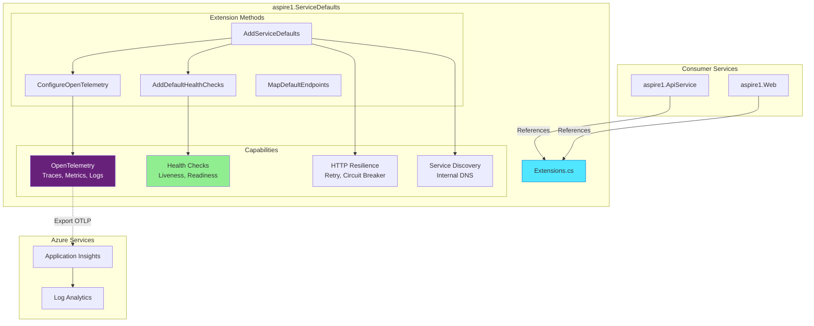
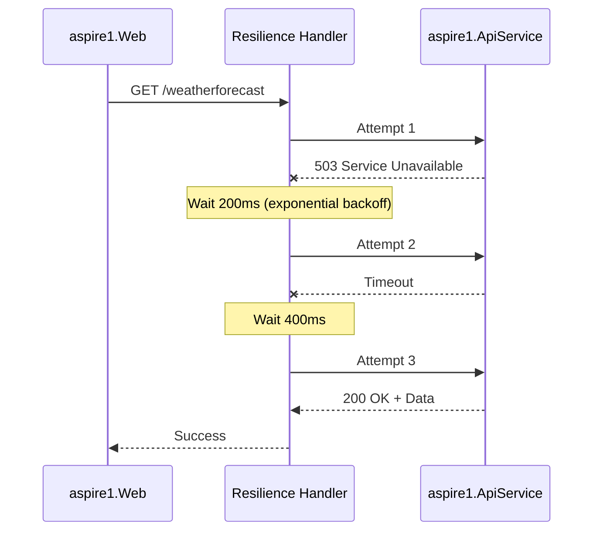
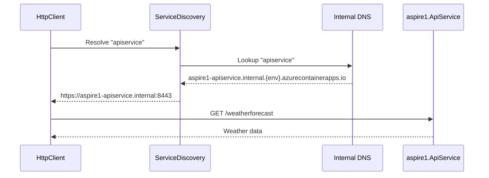

# Architecture - aspire1.ServiceDefaults

> **Component Type:** Shared Class Library
> **Framework:** .NET 10.0
> **Purpose:** Centralized Aspire defaults for OpenTelemetry, health checks, and resilience

## 🎯 Overview

The **ServiceDefaults** project is a shared library that provides common Aspire functionality to all services. It's the **foundation** for:

- OpenTelemetry instrumentation (traces, metrics, logs)
- Health checks (liveness, readiness)
- HTTP client resilience (retry, circuit breaker, timeout)
- Service discovery configuration

**Every service** in the aspire1 solution references this project and calls `builder.AddServiceDefaults()` at startup.

## 🏗️ Architecture



## 📦 Extension Methods

### `AddServiceDefaults<TBuilder>()`

**Purpose:** One-call setup for all Aspire defaults

**Usage:**

```csharp
// In Program.cs of aspire1.ApiService or aspire1.Web
var builder = WebApplication.CreateBuilder(args);
builder.AddServiceDefaults(); // ← Adds everything
```

**What It Does:**

1. Configures OpenTelemetry (traces, metrics, logs)
2. Adds default health checks
3. Enables service discovery
4. Configures HTTP client defaults (resilience + service discovery)

**Implementation:**

```csharp
public static TBuilder AddServiceDefaults<TBuilder>(this TBuilder builder)
    where TBuilder : IHostApplicationBuilder
{
    builder.ConfigureOpenTelemetry();
    builder.AddDefaultHealthChecks();

    builder.Services.AddServiceDiscovery();

    builder.Services.ConfigureHttpClientDefaults(http =>
    {
        // Turn on resilience by default
        http.AddStandardResilienceHandler();

        // Turn on service discovery by default
        http.AddServiceDiscovery();
    });

    return builder;
}
```

---

### `ConfigureOpenTelemetry<TBuilder>()`

**Purpose:** Set up distributed tracing, metrics, and structured logging

**OpenTelemetry Instrumentation:**

| Type        | Instrumented                                    | Exported To          |
| ----------- | ----------------------------------------------- | -------------------- |
| **Traces**  | ASP.NET Core requests, HttpClient calls         | Application Insights |
| **Metrics** | Request rate/duration, CPU, memory, exceptions  | Application Insights |
| **Logs**    | Structured logs with scopes, formatted messages | Application Insights |

**Traces Configuration:**

```csharp
.WithTracing(tracing =>
{
    tracing.AddSource(builder.Environment.ApplicationName)
        .AddAspNetCoreInstrumentation(options =>
            // Exclude health check endpoints from traces
            options.Filter = context =>
                !context.Request.Path.StartsWithSegments("/health")
                && !context.Request.Path.StartsWithSegments("/alive")
        )
        .AddHttpClientInstrumentation();
})
```

**Metrics Configuration:**

```csharp
.WithMetrics(metrics =>
{
    metrics.AddAspNetCoreInstrumentation()  // Request rate, duration
        .AddHttpClientInstrumentation()      // Outgoing HTTP metrics
        .AddRuntimeInstrumentation();        // CPU, memory, GC, threads
})
```

**Logs Configuration:**

```csharp
builder.Logging.AddOpenTelemetry(logging =>
{
    logging.IncludeFormattedMessage = true;  // Include formatted log message
    logging.IncludeScopes = true;            // Include log scopes
});
```

**Exporter Selection:**

```csharp
// Auto-detects OTEL_EXPORTER_OTLP_ENDPOINT environment variable
// If set → exports to Application Insights
// If not set → local Aspire dashboard only
private static TBuilder AddOpenTelemetryExporters<TBuilder>(this TBuilder builder)
{
    var useOtlpExporter = !string.IsNullOrWhiteSpace(
        builder.Configuration["OTEL_EXPORTER_OTLP_ENDPOINT"]);

    if (useOtlpExporter)
    {
        builder.Services.AddOpenTelemetry().UseOtlpExporter();
    }

    return builder;
}
```

---

### `AddDefaultHealthChecks<TBuilder>()`

**Purpose:** Add basic health checks for liveness probes

**Default Health Checks:**

| Check Name | Tag    | Purpose                    | Response         |
| ---------- | ------ | -------------------------- | ---------------- |
| `self`     | `live` | Verifies app is responsive | Always `Healthy` |

**Usage Example:**

```csharp
// Add custom health checks
builder.Services.AddHealthChecks()
    .AddCheck("self", () => HealthCheckResult.Healthy(), ["live"])
    .AddNpgSql(connectionString, name: "database", tags: ["ready"])
    .AddRedis(connectionString, name: "cache", tags: ["ready"]);
```

**Tags Explained:**

- **`live`**: Liveness probe - "Is the app alive?" (Always pass unless crashed)
- **`ready`**: Readiness probe - "Is the app ready to serve traffic?" (Check dependencies)

**Implementation:**

```csharp
public static TBuilder AddDefaultHealthChecks<TBuilder>(this TBuilder builder)
{
    builder.Services.AddHealthChecks()
        .AddCheck("self", () => HealthCheckResult.Healthy(), ["live"]);

    return builder;
}
```

---

### `MapDefaultEndpoints()`

**Purpose:** Expose health check endpoints for Container Apps probes

**Endpoints:**

| Path      | Purpose                                 | When Available   | Response                                |
| --------- | --------------------------------------- | ---------------- | --------------------------------------- |
| `/health` | Readiness - All health checks must pass | Development only | `Healthy` (200 OK) or `Unhealthy` (503) |
| `/alive`  | Liveness - Only "live" tag checks       | Development only | `Healthy` (200 OK) or `Unhealthy` (503) |

**Security Note:**

> Health checks are **only exposed in Development** by default. Production health checks should be configured in Azure Container Apps directly.

**Usage:**

```csharp
var app = builder.Build();

// ... other middleware ...

app.MapDefaultEndpoints();  // ← Add health endpoints
app.Run();
```

**Implementation:**

```csharp
public static WebApplication MapDefaultEndpoints(this WebApplication app)
{
    if (app.Environment.IsDevelopment())
    {
        // All health checks must pass
        app.MapHealthChecks("/health");

        // Only "live" checks must pass
        app.MapHealthChecks("/alive", new HealthCheckOptions
        {
            Predicate = r => r.Tags.Contains("live")
        });
    }

    return app;
}
```

## 🔌 HTTP Client Resilience

### Standard Resilience Handler

**Purpose:** Automatically retry failed HTTP requests with circuit breaker protection

**Policies Applied (via `AddStandardResilienceHandler()`):**

| Policy                 | Configuration                      | Purpose                    |
| ---------------------- | ---------------------------------- | -------------------------- |
| **Retry**              | 3 attempts, exponential backoff    | Transient failure recovery |
| **Circuit Breaker**    | Opens after 5 consecutive failures | Prevent cascading failures |
| **Timeout**            | 10 seconds per request             | Prevent hung requests      |
| **Bulkhead Isolation** | Limit concurrent requests          | Resource protection        |

**Example Flow:**



**Configuration (Optional Custom):**

```csharp
builder.Services.AddHttpClient<WeatherApiClient>(client =>
{
    client.BaseAddress = new("https+http://apiservice");
})
.AddStandardResilienceHandler(options =>
{
    options.Retry.MaxRetryAttempts = 5;
    options.CircuitBreaker.FailureRatio = 0.2; // Open after 20% failures
    options.AttemptTimeout.Timeout = TimeSpan.FromSeconds(5);
});
```

## 🔍 Service Discovery

### How It Works

**Configuration:**

```csharp
builder.Services.AddServiceDiscovery();

builder.Services.ConfigureHttpClientDefaults(http =>
{
    http.AddServiceDiscovery();  // Enable for all HttpClients
});
```

**Usage:**

```csharp
// In aspire1.Web
builder.Services.AddHttpClient<WeatherApiClient>(client =>
{
    // "apiservice" resolves to internal Container App URL
    client.BaseAddress = new("https+http://apiservice");
});
```

**Resolution Flow:**



**Scheme Resolution:**

- `https+http://apiservice` → Try HTTPS first, fallback to HTTP
- `https://apiservice` → HTTPS only (fail if not available)
- `http://apiservice` → HTTP only (insecure, not recommended)

## 📊 OpenTelemetry Examples

### Trace Example

**Scenario:** User requests weather data

```
Trace ID: abc123
├── Span: aspire1-web [GET /weather] (300ms)
│   ├── Span: HttpClient [GET https://apiservice/weatherforecast] (200ms)
│   │   └── Span: aspire1-apiservice [GET /weatherforecast] (150ms)
│   │       └── Span: Generate forecast data (50ms)
│   └── Span: Render Blazor component (50ms)
```

**Application Insights Query:**

```kql
dependencies
| where target == "apiservice"
| extend traceId = tostring(customDimensions.TraceId)
| join kind=inner (requests | where name == "GET /weatherforecast") on $left.traceId == $right.operation_Id
| project timestamp, web_duration=duration, api_duration=duration1, success
```

### Metric Example

**Key Metrics Collected:**

| Metric                                        | Description                 | Example                 |
| --------------------------------------------- | --------------------------- | ----------------------- |
| `http.server.request.duration`                | P50, P90, P95, P99 latency  | P95 = 250ms             |
| `http.server.active_requests`                 | Current concurrent requests | 45 requests             |
| `process.runtime.dotnet.gc.collections.count` | GC collection count         | 12 Gen0, 3 Gen1, 1 Gen2 |
| `process.runtime.dotnet.exception.count`      | Exception rate              | 2 exceptions/min        |

**Application Insights Query:**

```kql
customMetrics
| where name == "http.server.request.duration"
| extend percentile = tostring(customDimensions.Percentile)
| where percentile == "P95"
| summarize avg(value) by bin(timestamp, 5m)
| render timechart
```

### Log Example

**Structured Log with Scope:**

```csharp
using var scope = logger.BeginScope(new Dictionary<string, object>
{
    ["UserId"] = userId,
    ["TraceId"] = Activity.Current?.TraceId.ToString()
});

logger.LogInformation("Processing weather request for {DayCount} days", 5);
// Exported to Application Insights with full context
```

**Application Insights Query:**

```kql
traces
| extend userId = tostring(customDimensions.UserId)
| where message contains "Processing weather request"
| project timestamp, message, severityLevel, userId
```

## 🎯 Testing

### Unit Tests (Future)

```csharp
public class ServiceDefaultsTests
{
    [Fact]
    public void AddServiceDefaults_RegistersOpenTelemetry()
    {
        // Arrange
        var builder = Host.CreateApplicationBuilder();

        // Act
        builder.AddServiceDefaults();

        // Assert
        var services = builder.Services.BuildServiceProvider();
        var tracerProvider = services.GetService<TracerProvider>();
        tracerProvider.Should().NotBeNull();
    }

    [Fact]
    public void AddServiceDefaults_RegistersHealthChecks()
    {
        // Arrange
        var builder = Host.CreateApplicationBuilder();

        // Act
        builder.AddServiceDefaults();

        // Assert
        var services = builder.Services.BuildServiceProvider();
        var healthCheck = services.GetService<HealthCheckService>();
        healthCheck.Should().NotBeNull();
    }
}
```

## 🐛 Troubleshooting

### OpenTelemetry Not Exporting

**Symptom:** No traces/metrics in Application Insights

**Diagnostics:**

```bash
# Check OTLP endpoint is set
azd env get-values | findstr OTEL_EXPORTER_OTLP_ENDPOINT
```

**Fix:**

- Ensure `OTEL_EXPORTER_OTLP_ENDPOINT` environment variable is set
- Verify Application Insights is provisioned
- Check Application Insights connection string in Key Vault

### Health Checks Always Fail

**Symptom:** Container Apps shows "Unhealthy" status

**Diagnostics:**

```bash
# Test health endpoint locally
curl http://localhost:8080/health
```

**Fix:**

- Ensure `MapDefaultEndpoints()` is called in `Program.cs`
- Check custom health checks aren't failing
- Verify Container App health probe path matches `/health` or `/alive`

### Service Discovery Fails

**Symptom:** `HttpRequestException: No such host is known`

**Diagnostics:**

```bash
# Check service discovery configuration
azd env get-values | findstr services__
```

**Fix:**

- Ensure `AddServiceDiscovery()` is called in ServiceDefaults
- Verify AppHost uses `WithReference()` to link services
- Check service name matches: `"apiservice"` (not `"aspire1.ApiService"`)

## 📚 Related Documentation

- [Root Architecture](../ARCHITECTURE.md)
- [AppHost Architecture](../aspire1.AppHost/ARCHITECTURE.md)
- [API Service Architecture](../aspire1.ApiService/ARCHITECTURE.md)
- [Web Service Architecture](../aspire1.Web/ARCHITECTURE.md)

## 🔗 Useful Resources

- [.NET Aspire Service Defaults](https://learn.microsoft.com/dotnet/aspire/fundamentals/service-defaults)
- [OpenTelemetry .NET](https://opentelemetry.io/docs/languages/net/)
- [ASP.NET Core Health Checks](https://learn.microsoft.com/aspnet/core/host-and-deploy/health-checks)
- [Polly Resilience](https://www.pollydocs.org/)

---

**Complete:** All project architectures documented ✅
