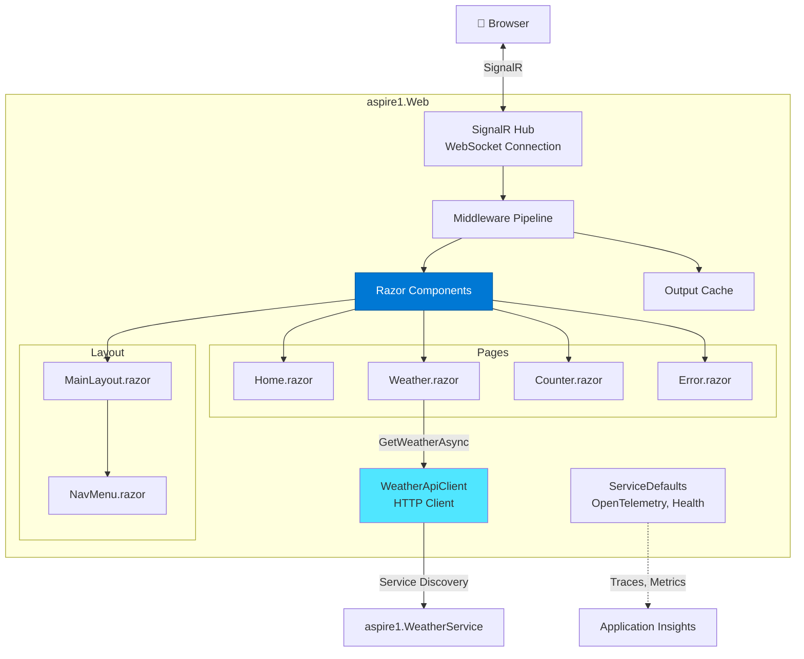
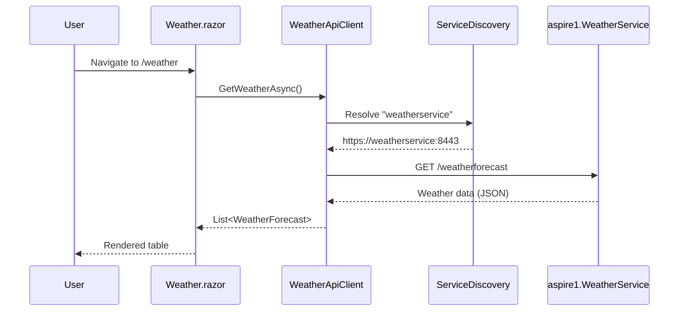
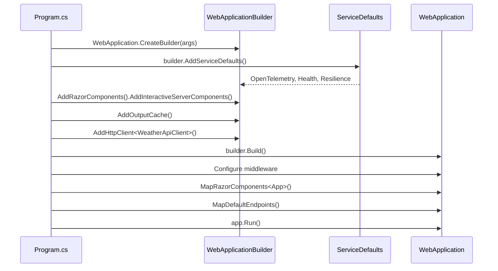

# Architecture - aspire1.Web

> **Component Type:** Blazor Server
> **Framework:** ASP.NET Core 10.0
> **Purpose:** Public-facing web frontend with server-side rendering

## 🎯 Overview

The **Web** project is a Blazor Server application that provides the user interface for the aspire1 solution. Key features:

- Server-side Blazor rendering (no WebAssembly)
- Real-time SignalR connection for UI updates
- HTTP client integration with service discovery
- OpenTelemetry instrumentation (via ServiceDefaults)
- Output caching for performance

## 🏗️ Architecture



## 📄 Pages & Components

### `/` - Home.razor

**Purpose:** Landing page with welcome message

**Features:**

- Static content
- No API calls
- Demonstrates basic Blazor component

---

### `/counter` - Counter.razor

**Purpose:** Interactive counter demo (100% server-side)

**Features:**

- Server-side state management
- SignalR-based UI updates
- Demonstrates Blazor event handling

**Custom Telemetry:**

```csharp
private void IncrementCount()
{
    currentCount++;

    // Track counter clicks with range categorization
    ApplicationMetrics.CounterClicks.Add(1,
        new KeyValuePair<string, object?>("page", "counter"),
        new KeyValuePair<string, object?>("range",
            ApplicationMetrics.GetCountRange(currentCount)));
}
```

**Metric Tags:**

- `page`: "counter"
- `range`: "0-10", "11-50", "51-100", or "100+"

**Implementation:**

```razor
@page "/counter"

<h1>Counter</h1>
<p role="status">Current count: @currentCount</p>
<button @onclick="IncrementCount">Click me</button>

@code {
    private int currentCount = 0;

    private void IncrementCount()
    {
        currentCount++;
        // SignalR pushes update to browser automatically
    }
}
```

---

### `/weather` - Weather.razor

**Purpose:** Display weather forecast from API service

**Features:**

- HTTP client with service discovery
- Loading state
- Error handling
- Data binding

**Flow:**



---

### `/error` - Error.razor

**Purpose:** Error boundary for unhandled exceptions

**Features:**

- User-friendly error page
- Hides sensitive error details in production
- OpenTelemetry automatically captures exception traces

## 🔌 Service Integration

### WeatherApiClient.cs

**Purpose:** Typed HTTP client for API service communication

**Configuration:**

```csharp
builder.Services.AddHttpClient<WeatherApiClient>(client =>
{
    // Service discovery: "weatherservice" resolves to internal URL
    client.BaseAddress = new("https+http://weatherservice");
});
```

**Key Features:**

- **Service Discovery:** `"weatherservice"` name resolves via Aspire
- **Resilience:** Automatic retry, circuit breaker, timeout (from ServiceDefaults)
- **Scheme Preference:** `https+http://` prefers HTTPS, falls back to HTTP
- **Instrumentation:** All HTTP calls traced via OpenTelemetry

**Implementation:**

```csharp
public class WeatherApiClient(HttpClient httpClient)
{
    public async Task<WeatherForecast[]?> GetWeatherAsync(
        int maxItems = 10,
        CancellationToken cancellationToken = default)
    {
        // Calls: https://apiservice:8443/weatherforecast?maxItems=10
        return await httpClient.GetFromJsonAsync<WeatherForecast[]>(
            $"/weatherforecast?maxItems={maxItems}",
            cancellationToken);
    }
}

public record WeatherForecast(DateOnly Date, int TemperatureC, string? Summary)
{
    public int TemperatureF => 32 + (int)(TemperatureC / 0.5556);
}
```

## 🎨 Layout & Styling

### MainLayout.razor

**Purpose:** Application shell (navigation + content area)

**Structure:**

```razor
<div class="page">
    <div class="sidebar">
        <NavMenu />
    </div>

    <main>
        <article class="content">
            @Body  <!-- Page content renders here -->
        </article>
    </main>
</div>
```

### NavMenu.razor

**Purpose:** Navigation links

**Routes:**

- `/` - Home
- `/counter` - Counter
- `/weather` - Weather

### Styling

- **Framework:** Bootstrap 5
- **Location:** `wwwroot/lib/bootstrap/`
- **Custom CSS:** `wwwroot/app.css`

## 🔧 Startup Configuration

### Program.cs Flow



### Key Configuration Steps

1. **Service Defaults:** OpenTelemetry, health checks, resilience handlers
2. **Razor Components:** Blazor Server rendering engine
3. **Interactive Server Mode:** SignalR-based component updates
4. **Output Cache:** Response caching for performance
5. **HTTP Client:** Typed client with service discovery
6. **Middleware Pipeline:**
   - Exception handler (production)
   - HSTS (production)
   - HTTPS redirection
   - Antiforgery tokens (CSRF protection)
   - Static files
7. **Health Endpoints:** `/health`, `/alive` (from ServiceDefaults)

## 📊 Performance Optimization

### Output Caching

**Purpose:** Cache responses to reduce load on API service

**Configuration:**

```csharp
builder.Services.AddOutputCache();
app.UseOutputCache();
```

**Usage Example (Future):**

```csharp
// Cache weather data for 60 seconds
app.MapGet("/api/weather", async (WeatherApiClient client) =>
{
    return await client.GetWeatherAsync();
})
.CacheOutput(policy => policy.Expire(TimeSpan.FromSeconds(60)));
```

### SignalR Optimization

**Connection Management:**

- **Reconnection:** Automatic with exponential backoff
- **Compression:** Enabled by default
- **Transport:** WebSocket preferred, falls back to Server-Sent Events

**Best Practices:**

- Keep component state minimal
- Use `@key` directives for efficient rendering
- Avoid frequent state changes (debounce user input)

## 🔐 Configuration & Secrets

### Configuration Sources (Priority Order)

1. **Environment Variables** (highest priority)

   - `ASPNETCORE_ENVIRONMENT` - `Development`, `Staging`, `Production`
   - `APP_VERSION` - Injected by AppHost or azd
   - `COMMIT_SHA` - Injected by AppHost or GitHub Actions

2. **appsettings.{Environment}.json**

   - Environment-specific settings

3. **appsettings.json**

   - Default settings

4. **User Secrets** (local dev only)
   - `dotnet user-secrets set "Key" "Value"`

### Example: Adding Feature Flags (Future)

```csharp
// Add Azure App Configuration
builder.Configuration.AddAzureAppConfiguration(options =>
{
    options.Connect(new Uri(builder.Configuration["AppConfig:Endpoint"]!),
                    new DefaultAzureCredential())
           .UseFeatureFlags();
});

// Use in Razor component
@inject IFeatureManager FeatureManager

@if (await FeatureManager.IsEnabledAsync("NewWeatherUI"))
{
    <NewWeatherComponent />
}
else
{
    <Weather />
}
```

## 🚀 Deployment

### Local Development

```bash
# Run standalone (requires AppHost for service discovery to API)
dotnet run --project aspire1.Web

# Access app
# https://localhost:7001
```

### Azure Container Apps

**Container Image:**

- **Registry:** `{acr}.azurecr.io`
- **Repository:** `aspire1-web`
- **Tag:** `{version}` (e.g., `1.0.0`)

**Environment Variables (injected by azd):**

- `APP_VERSION`: `1.0.0`
- `COMMIT_SHA`: `a1af010`
- `ASPNETCORE_ENVIRONMENT`: `Production`
- `services__weatherservice__https__0`: `https://aspire1-weatherservice.internal.{env}.azurecontainerapps.io` (service discovery)

**Ingress:**

- **Type:** External (public internet)
- **Port:** 8080
- **Transport:** HTTP/2
- **Allow Insecure:** No (HTTPS only)

**Health Probes:**

```yaml
livenessProbe:
  httpGet:
    path: /alive
    port: 8080
  initialDelaySeconds: 5
  periodSeconds: 10

readinessProbe:
  httpGet:
    path: /health
    port: 8080
  initialDelaySeconds: 10
  periodSeconds: 5
```

**Scaling:**

- **Min Replicas:** 1 (always warm)
- **Max Replicas:** 10
- **Scale Rule:** HTTP - 100 concurrent requests per replica
- **Scale In Delay:** 5 minutes

## 🎯 Testing

### Unit Tests (Future)

```csharp
// Example with bUnit + xUnit
public class WeatherPageTests : TestContext
{
    [Fact]
    public void Weather_ShowsLoadingMessage_Initially()
    {
        // Arrange
        var mockClient = Substitute.For<WeatherApiClient>();
        Services.AddSingleton(mockClient);

        // Act
        var cut = RenderComponent<Weather>();

        // Assert
        cut.Find("p").TextContent.Should().Contain("Loading...");
    }

    [Fact]
    public async Task Weather_DisplaysData_AfterLoading()
    {
        // Arrange
        var mockClient = Substitute.For<WeatherApiClient>();
        mockClient.GetWeatherAsync().Returns([
            new WeatherForecast(DateOnly.FromDateTime(DateTime.Now), 25, "Sunny")
        ]);
        Services.AddSingleton(mockClient);

        // Act
        var cut = RenderComponent<Weather>();
        await cut.InvokeAsync(() => { }); // Wait for OnInitializedAsync

        // Assert
        cut.Find("table").Should().NotBeNull();
        cut.Find("td").TextContent.Should().Contain("Sunny");
    }
}
```

### Integration Tests (Future)

```csharp
// Example with Aspire.Hosting.Testing
public class WebIntegrationTests : IAsyncLifetime
{
    private DistributedApplication _app = null!;
    private HttpClient _client = null!;

    public async Task InitializeAsync()
    {
        var appHost = await DistributedApplicationTestingBuilder
            .CreateAsync<Projects.aspire1_AppHost>();
        _app = await appHost.BuildAsync();
        await _app.StartAsync();

        _client = _app.CreateHttpClient("webfrontend");
    }

    [Fact]
    public async Task HomePage_ReturnsSuccess()
    {
        // Act
        var response = await _client.GetAsync("/");

        // Assert
        response.StatusCode.Should().Be(HttpStatusCode.OK);
        var html = await response.Content.ReadAsStringAsync();
        html.Should().Contain("Hello, world!");
    }

    [Fact]
    public async Task WeatherPage_CallsWeatherService()
    {
        // Act
        var response = await _client.GetAsync("/weather");

        // Assert
        response.StatusCode.Should().Be(HttpStatusCode.OK);
        var html = await response.Content.ReadAsStringAsync();
        html.Should().Contain("Weather Forecast");
    }

    public async Task DisposeAsync() => await _app.DisposeAsync();
}
```

## 🐛 Troubleshooting

### SignalR Connection Fails

**Symptom:** Browser console shows WebSocket errors, components don't update

**Diagnostics:**

```javascript
// Browser console
Blazor: WebSocket connection failed: Error during WebSocket handshake
```

**Fix:**

- Ensure WebSocket is enabled in ACA ingress
- Check firewall rules (WebSocket uses port 8080)
- Verify HTTPS is configured (SignalR requires HTTPS in production)

### Service Discovery Fails

**Symptom:** `WeatherApiClient` throws `HttpRequestException`

**Diagnostics:**

```bash
# Check service discovery environment variable
azd env get-values | findstr apiservice
```

**Fix:**

- Ensure AppHost uses `WithReference(apiService)` on Web
- Verify base address uses service name: `https+http://apiservice`
- Check API service is healthy: `curl https://apiservice:8443/health`

### Weather Page Shows "Loading..." Forever

**Symptom:** Weather page never loads data

**Diagnostics:**

- Check browser developer tools → Network tab
- Check Application Insights for failed dependencies

**Fix:**

- Ensure API service is running and healthy
- Verify `WeatherApiClient` is registered in DI container
- Check for exceptions in API service logs

## ✅ Best Practices vs ❌ Anti-Patterns

### 1. Service Discovery

#### ❌ BAD: Hard-coded API URL

```csharp
builder.Services.AddHttpClient<WeatherApiClient>(client =>
{
    client.BaseAddress = new("https://my-api-service.azurecontainerapps.io");
});
```

**Why it's bad:** Environment-specific URLs, breaks local dev, no failover, manual DNS updates

#### ✅ GOOD: Service discovery with scheme preference (Current implementation)

```csharp
builder.Services.AddHttpClient<WeatherApiClient>(client =>
{
    // "apiservice" resolves via Aspire service discovery
    client.BaseAddress = new("https+http://apiservice");
});
```

**Why it's good:** Works in all environments, automatic DNS resolution, HTTPS preferred, HTTP fallback

---

### 2. HTTP Client Registration

#### ❌ BAD: Manual HttpClient instantiation

```csharp
public class WeatherApiClient
{
    private readonly HttpClient _client = new(); // Don't do this!

    public WeatherApiClient()
    {
        _client.BaseAddress = new("http://apiservice");
    }
}
```

**Why it's bad:** Socket exhaustion, no resilience, no service discovery, no telemetry

#### ✅ GOOD: Typed client with DI (Current implementation)

```csharp
// Program.cs
builder.Services.AddHttpClient<WeatherApiClient>(client =>
{
    client.BaseAddress = new("https+http://apiservice");
});

// WeatherApiClient.cs
public class WeatherApiClient(HttpClient httpClient)
{
    // Primary constructor injection
    public async Task<WeatherForecast[]> GetWeatherAsync(...)
    {
        return await httpClient.GetFromJsonAsAsyncEnumerable<WeatherForecast>(...);
    }
}
```

**Why it's good:** IHttpClientFactory manages lifetime, resilience via ServiceDefaults, telemetry built-in

---

### 3. HTTP Resilience

#### ❌ BAD: Raw HttpClient with no retry logic

```csharp
builder.Services.AddHttpClient<WeatherApiClient>(client =>
{
    client.BaseAddress = new("https+http://apiservice");
}); // No resilience handlers
```

**Why it's bad:** Transient failures crash UI, no circuit breaker, no timeout protection

#### ✅ GOOD: ServiceDefaults auto-configures resilience (Current implementation)

```csharp
builder.AddServiceDefaults(); // ← Adds standard resilience handler to ALL HttpClients

// Resilience policies applied automatically:
// - Retry: 3 attempts, exponential backoff
// - Circuit Breaker: Opens after 5 consecutive failures
// - Timeout: 10 seconds per request
```

**Why it's good:** Transient failure recovery, prevents cascading failures, consistent across services

---

### 4. Blazor Streaming & Caching

#### ❌ BAD: No caching or streaming

```razor
@page "/weather"

@code {
    protected override async Task OnInitializedAsync()
    {
        forecasts = await WeatherApi.GetWeatherAsync();
        // Every navigation = new API call, no streaming, slow initial render
    }
}
```

**Why it's bad:** Repeated API calls, slow perceived performance, server load

#### ✅ GOOD: StreamRendering + OutputCache (Current implementation)

```razor
@page "/weather"
@attribute [StreamRendering(true)]
@attribute [OutputCache(Duration = 5)]

@code {
    protected override async Task OnInitializedAsync()
    {
        forecasts = await WeatherApi.GetWeatherAsync();
        // Streams UI incrementally, caches for 5 seconds
    }
}
```

**Why it's good:** Fast initial render, reduced API calls, better UX, lower server load

---

### 5. Async Enumerable Pattern

#### ❌ BAD: Buffering entire response in memory

```csharp
public async Task<WeatherForecast[]> GetWeatherAsync(...)
{
    var response = await httpClient.GetFromJsonAsync<WeatherForecast[]>("/weatherforecast");
    return response!; // Loads entire array before processing
}
```

**Why it's bad:** High memory usage for large datasets, no streaming benefits, blocks thread

#### ✅ GOOD: Streaming with IAsyncEnumerable (Current implementation)

```csharp
public async Task<WeatherForecast[]> GetWeatherAsync(int maxItems = 10, CancellationToken cancellationToken = default)
{
    List<WeatherForecast>? forecasts = null;

    await foreach (var forecast in httpClient.GetFromJsonAsAsyncEnumerable<WeatherForecast>("/weatherforecast", cancellationToken))
    {
        if (forecasts?.Count >= maxItems)
        {
            break; // Stop early if maxItems reached
        }
        if (forecast is not null)
        {
            forecasts ??= [];
            forecasts.Add(forecast);
        }
    }

    return forecasts?.ToArray() ?? [];
}
```

**Why it's good:** Memory efficient, can stop early, supports cancellation, streams data

---

### 6. Blazor Component State Management

#### ❌ BAD: Static state or singletons

```csharp
public class WeatherService
{
    private static WeatherForecast[]? _cachedData; // Don't do this in Blazor Server!

    public async Task<WeatherForecast[]> GetWeatherAsync()
    {
        if (_cachedData != null) return _cachedData;
        _cachedData = await FetchData();
        return _cachedData;
    }
}
```

**Why it's bad:** State shared across all users/circuits, memory leaks, race conditions, security risk

#### ✅ GOOD: Scoped services + component-level state (Current implementation)

```razor
@inject WeatherApiClient WeatherApi

@code {
    private WeatherForecast[]? forecasts; // Component-scoped

    protected override async Task OnInitializedAsync()
    {
        forecasts = await WeatherApi.GetWeatherAsync();
    }
}
```

**Why it's good:** Isolated per circuit, no cross-user contamination, automatic cleanup, thread-safe

---

### 7. Output Caching Configuration

#### ❌ BAD: No caching or app-level only

```csharp
builder.Services.AddOutputCache(); // Registered but never used
```

**Why it's bad:** Misses opportunity to reduce API calls, inconsistent performance

#### ✅ GOOD: Page-level caching (Current implementation)

```csharp
// Program.cs
builder.Services.AddOutputCache();
app.UseOutputCache();

// Weather.razor
@attribute [OutputCache(Duration = 5)]
```

**Why it's good:** Reduced API load, configurable per-page, balances freshness vs performance

---

### 8. Error Boundaries

#### ❌ BAD: No error handling

```razor
@page "/weather"

@code {
    protected override async Task OnInitializedAsync()
    {
        forecasts = await WeatherApi.GetWeatherAsync(); // Unhandled exceptions crash circuit
    }
}
```

**Why it's bad:** Entire app crashes on API failure, poor user experience, no recovery

#### ✅ GOOD: Error.razor page + exception handler (Current implementation)

```csharp
// Program.cs
app.UseExceptionHandler("/Error", createScopeForErrors: true);

// Error.razor exists to catch unhandled exceptions
```

**Why it's good:** Graceful degradation, user-friendly error page, preserves circuit, logs exceptions

---

### 9. HTTPS & Security

#### ❌ BAD: Allow HTTP in production

```csharp
// No HSTS, no HTTPS redirection
app.Run();
```

**Why it's bad:** Man-in-the-middle attacks, session hijacking, SignalR may not work

#### ✅ GOOD: HTTPS redirection + HSTS (Current implementation)

```csharp
if (!app.Environment.IsDevelopment())
{
    app.UseHsts(); // 30 days default
}

app.UseHttpsRedirection(); // Force HTTPS
```

**Why it's good:** Enforces encryption, prevents downgrade attacks, browser caching, SignalR-compatible

---

### 10. Antiforgery Protection

#### ❌ BAD: No CSRF protection

```csharp
builder.Services.AddRazorComponents()
    .AddInteractiveServerComponents();
// No antiforgery middleware
```

**Why it's bad:** Vulnerable to CSRF attacks, form spoofing, session hijacking

#### ✅ GOOD: Antiforgery middleware (Current implementation)

```csharp
builder.Services.AddRazorComponents()
    .AddInteractiveServerComponents();

app.UseAntiforgery(); // Required for Blazor Server forms
```

**Why it's good:** CSRF protection, validates tokens, secure form submissions, Blazor requirement

---

### 11. Service Registration Order

#### ❌ BAD: ServiceDefaults after specific registrations

```csharp
builder.Services.AddRazorComponents();
builder.Services.AddHttpClient<WeatherApiClient>(...);
builder.AddServiceDefaults(); // Too late! Won't configure existing HttpClient
```

**Why it's bad:** ServiceDefaults can't apply to already-registered services, inconsistent config

#### ✅ GOOD: ServiceDefaults first (Current implementation)

```csharp
builder.AddServiceDefaults(); // First! Configures HttpClient defaults

builder.Services.AddRazorComponents()
    .AddInteractiveServerComponents();
builder.Services.AddHttpClient<WeatherApiClient>(...); // Inherits defaults
```

**Why it's good:** All HttpClients get resilience + service discovery, consistent configuration

---

### 12. Static Asset Handling

#### ❌ BAD: Old UseStaticFiles

```csharp
app.UseStaticFiles(); // .NET 8 pattern
```

**Why it's bad:** Misses .NET 9+ optimizations (fingerprinting, compression)

#### ✅ GOOD: MapStaticAssets (Current implementation)

```csharp
app.MapStaticAssets(); // .NET 9+ optimization
```

**Why it's good:** Automatic fingerprinting, better caching, CDN-friendly, performance boost

## 📚 Related Documentation

- [Root Architecture](../ARCHITECTURE.md)
- [AppHost Architecture](../aspire1.AppHost/ARCHITECTURE.md)
- [API Service Architecture](../aspire1.WeatherService/ARCHITECTURE.md)
- [Service Defaults](../aspire1.ServiceDefaults/ARCHITECTURE.md)

## 🔗 Useful Commands

```bash
# Run with hot reload
dotnet watch --project aspire1.Web

# Test locally (requires AppHost)
dotnet run --project aspire1.AppHost
# Navigate to: https://localhost:7001

# Build release
dotnet publish -c Release

# Run in container locally
docker build -t aspire1-web:1.0.0 .
docker run -p 8080:8080 -e APP_VERSION=1.0.0 aspire1-web:1.0.0
```

---

**Next:** [Service Defaults Architecture](../aspire1.ServiceDefaults/ARCHITECTURE.md) →
